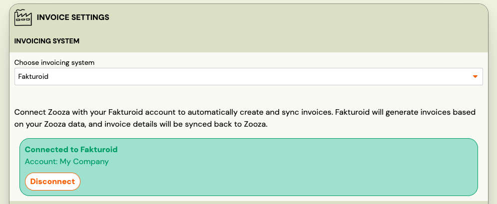

# Fakturoid Integration

Fakturoid is a Czech and Slovak cloud invoicing platform. When connected, Zooza creates invoices directly in your Fakturoid account — no manual export needed.

**Market:** Czech Republic / Slovakia
**Setup effort:** Connect once (OAuth) — no re-authorization required

---

## Before you start

You need an active [Fakturoid](https://www.fakturoid.cz/) account. No API keys to copy — Zooza connects via OAuth (one-click authorization).

---

## Setup

1. Go to **Settings → Billing** and open your Invoice Profile.
2. In the **Invoice Engine** section, select **Fakturoid**.
3. Click **Connect to Fakturoid** — you will be redirected to Fakturoid to log in and authorize Zooza.
4. After authorization you are redirected back to Zooza. The connection is active immediately.
5. Click **Save**.

That's it. Unlike Xero, the connection does not expire — you connect once and it stays active.

---

## How invoices work

Once connected:

- Every time a payment is recorded in Zooza, an invoice is created in your Fakturoid account.
- Zooza looks up the customer in Fakturoid by email and name. If the customer doesn't exist yet, Zooza creates them automatically. If their details have changed, Zooza updates them.
- Fakturoid generates the PDF asynchronously — it may take a moment. Zooza retries automatically. In rare cases, if the PDF is not available yet, come back and refresh the invoice.
- Payment sync is supported: payments are recorded against the invoice in Fakturoid, and Fakturoid can optionally send a payment confirmation email to the client.

---

## What works and what doesn't

| Feature | Status |
|---|---|
| Invoice creation | ✓ Automatic |
| Customer management | ✓ Automatic (create and update) |
| PDF generation | ✓ Async — system retries automatically |
| Payment sync | ✓ Partial — payments recorded in Fakturoid |
| Re-authorization | Not needed — connection stays active indefinitely |
| Credit notes | ✗ Not supported — issue in Fakturoid directly |
| Editing invoices after creation | Edit in Fakturoid — changes sync back to Zooza only after a manual refresh |

---

## Known issues

**PDF not immediately available** — Fakturoid generates PDFs asynchronously. If the PDF link is missing right after invoice creation, wait a moment and click the refresh button on the invoice. The system will re-fetch it from Fakturoid.

---

## Related

- [Invoicing overview](./invoicing-overview.md) — how invoice engines work
- [Billing and invoicing](./billing-and-invoicing.md) — Invoice Profiles, auto/manual generation, multi-line
- [Invoices list](../reference/invoices-list.md) — browsing and downloading invoices
