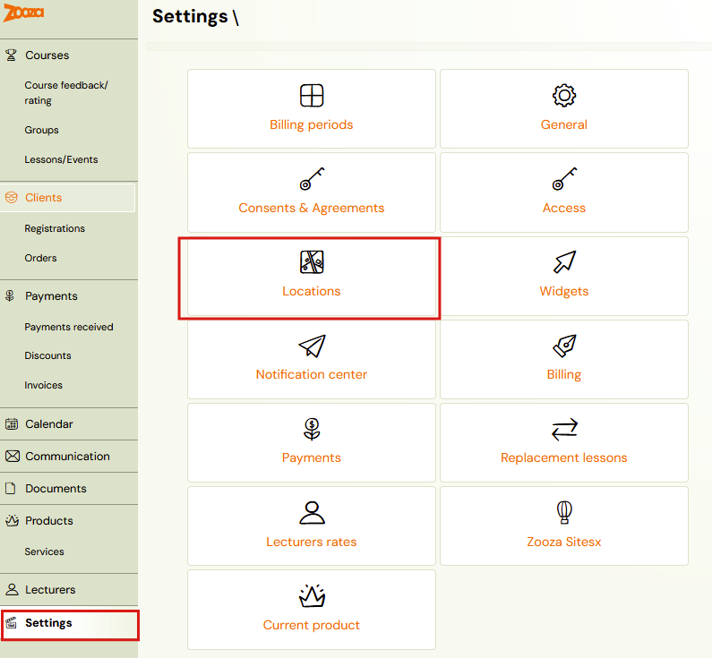
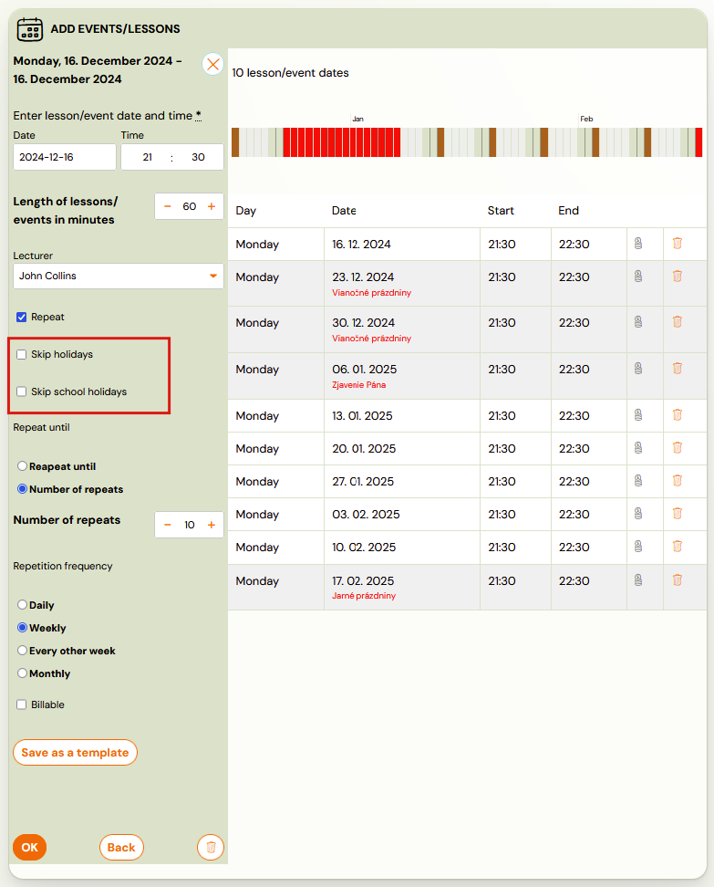

# Holiday settings

You must have the correct region filled in for each location in order for the app to automatically pull in vacations correctly.

## General settings

1. You can make the settings in the main *Settings*, under *Places.*
 

1. When adding a new location or editing an existing one, select a
region from the menu. The offer is updated on the basis of the company
region you entered in the application when creating an account in the
application. If you would like to change this region, please feel free
to contact us via chat on this page or by email at [support@zooza.online](mailto:support@zooza.online).
 

1. After selecting the region, click *the Save* button at the bottom of the page.

## Regional holidays

Holidays are different for each state, city and region. That’s why we
 went to a detailed solution where you can set a region for each
location you run your programmes in.

Based on this setting, the holidays of the specific region will be
automatically added to your app. You will see the specific dates of the
holidays at the level of inserting sessions into the class, where you will
be reminded that the dates are during the holidays. You can choose to:

- keep these terms, if you are running your programmes also during the holidays
- delete these terms manually by clicking on the *Bin icon*
- skip these terms automatically by clicking on the *Skip Holidays* and *Skip School breaks* checkboxes

