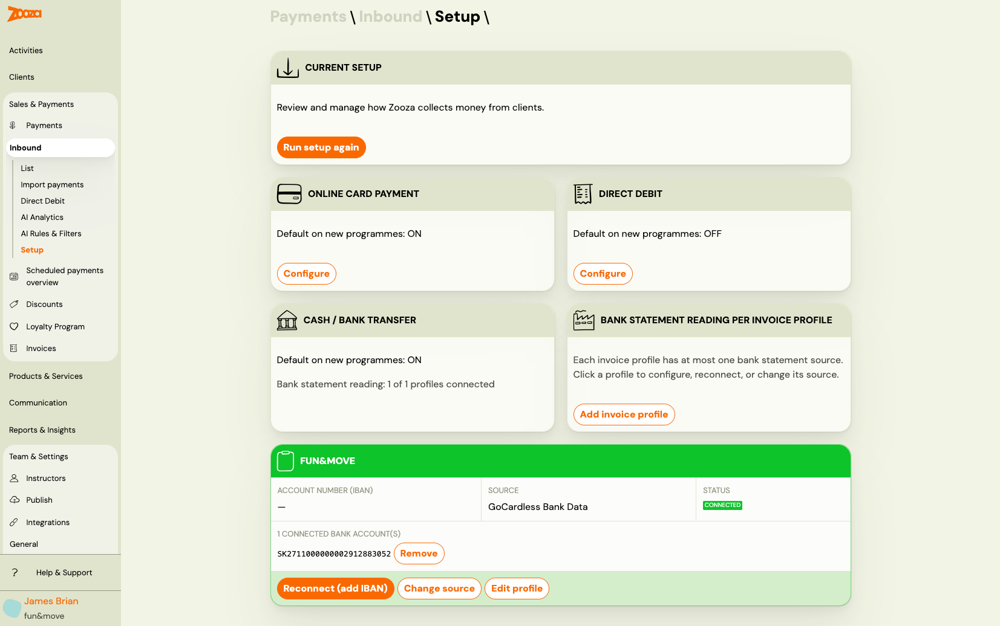
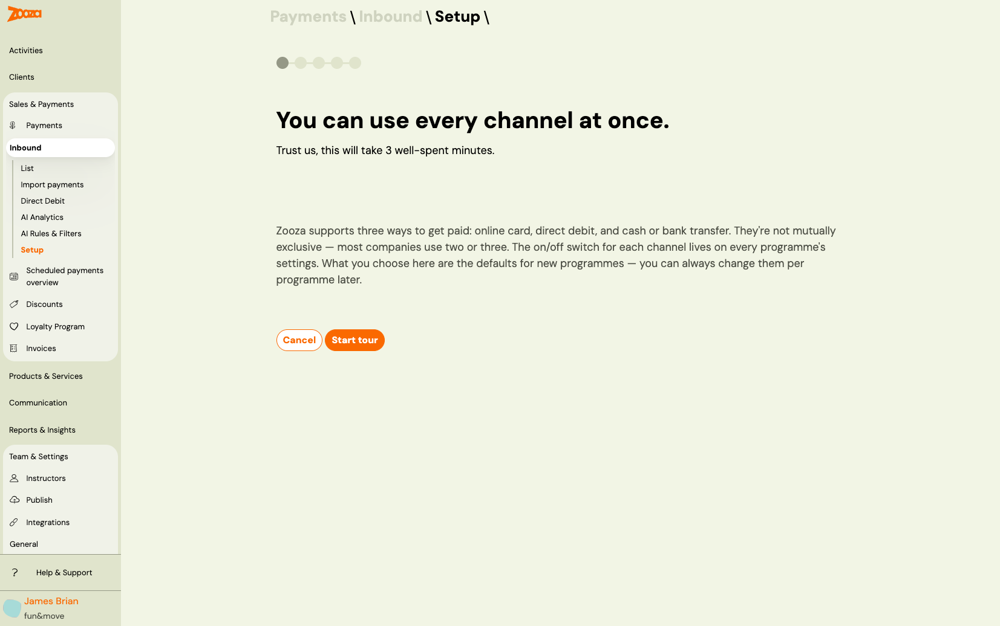
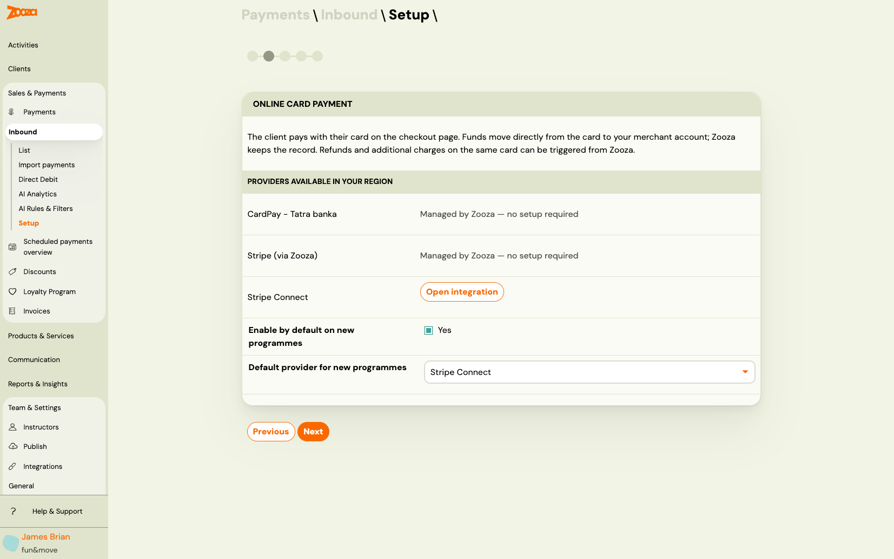
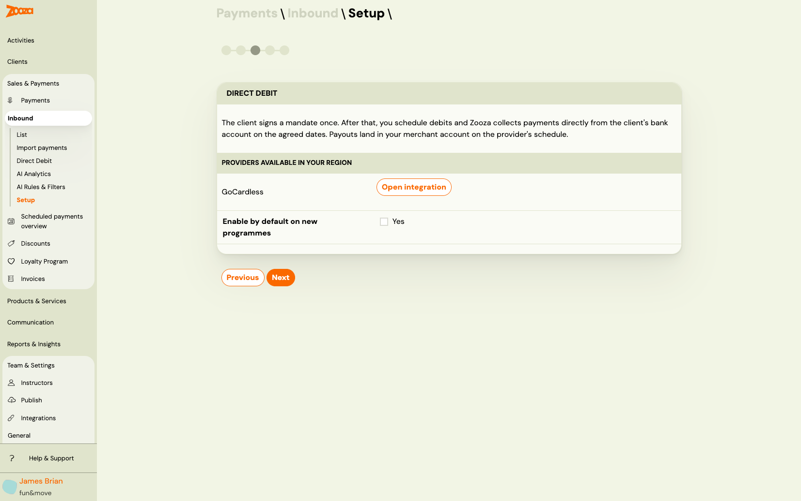
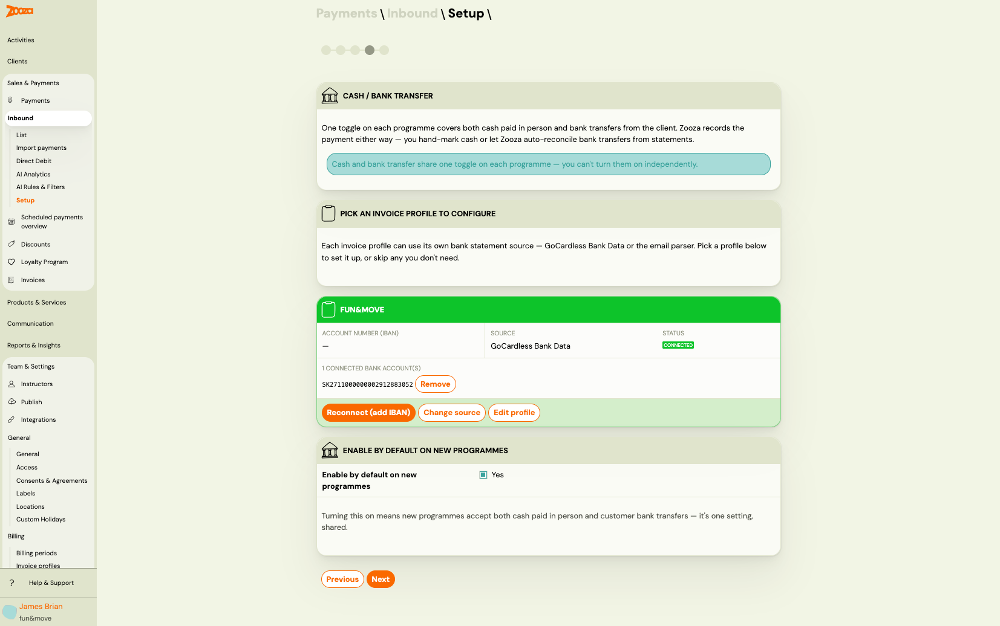
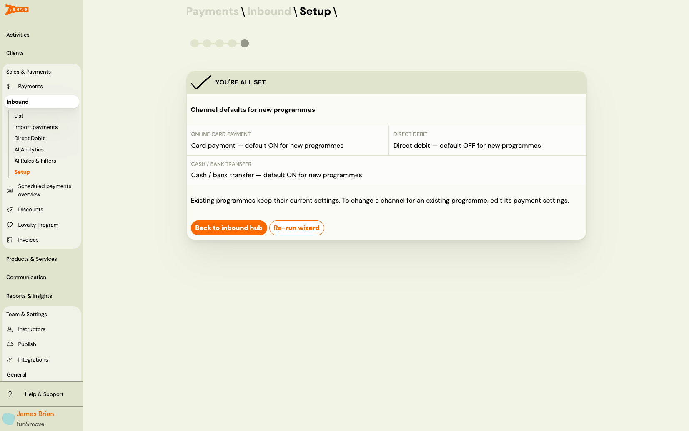
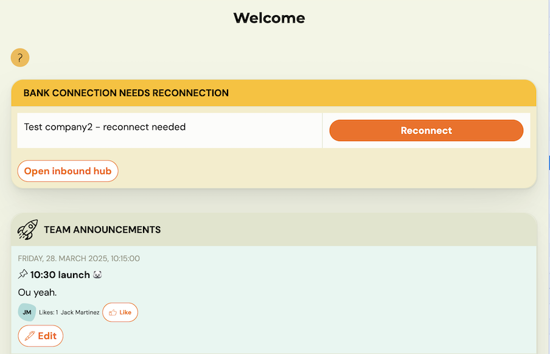

# Set up how Zooza collects money from clients

The **Inbound Payments Setup** wizard configures three things at once:

1. Which payment channels (online card, direct debit, cash / bank transfer) are available and which are enabled by default on new programmes
2. Which providers are connected for each channel (Stripe, GoCardless, Tatra Banka, etc.)
3. How Zooza reads your bank statements per billing profile — so incoming bank transfers are automatically matched to bookings

> **Navigation:** Payments → Inbound → Setup  
> **Permission:** Owner role (or assistant with `allow_assistant_to_manage_payments`)

---

## Current setup — what you see first

When you open **Payments → Inbound → Setup**, the first screen shows your current configuration at a glance.

The screen has two sections:

**Top — the three channels:**

| Tile | What it shows |
|---|---|
| **Online card payment** | Whether card payment is the default for new programmes, and a **Configure** button |
| **Direct debit** | Whether direct debit is the default for new programmes, and a **Configure** button |
| **Cash / bank transfer** | Whether cash is the default, plus a summary line like *"Bank statement reading: 1 of 1 profiles connected"* |

**Bottom — bank statement reading per billing profile:**

Each billing profile has its own card showing which method is reading its bank statements (GoCardless Bank Data or email parser), the connection status, and the list of connected IBANs.

From here you can:
- Click **Reconnect (add IBAN)** to add or refresh a GoCardless bank connection
- Click **Change source** to switch between GoCardless and email parser
- Click **Edit profile** to go to the billing profile settings
- Click **Run setup again** to re-run the full wizard tour

---

## Running the wizard for the first time

If no setup has been completed yet, clicking **Setup** in the Inbound menu launches the wizard automatically starting from the intro step.

### Step 1 — Intro

The intro explains the key concept: **all three channels can be active at the same time**. They are not mutually exclusive. Most companies use two or three simultaneously.

The on/off switches for each channel live on individual programme settings pages. What the wizard configures here are the **defaults for new programmes** — existing programmes are not changed.

Click **Start tour** to walk through each channel.

---

### Step 2 — Online card payment

The online card step shows which card payment providers are available in your region:

| Provider | How it works |
|---|---|
| **CardPay — Tatra banka** | Managed by Zooza — no additional setup required (SK/CZ only) |
| **Stripe (via Zooza)** | Managed by Zooza — no additional setup required |
| **Stripe Connect** | Your own Stripe account — click **Open integration** to connect |

**Enable by default on new programmes** — when turned on, every new programme will have online card payment active from the start. You can always change this per programme later.

**Default provider for new programmes** — if multiple providers are connected, pick which one to use on new programmes by default.

Click **Next** to continue.

---

### Step 3 — Direct debit

Direct debit lets you collect payments on a schedule — the client signs a mandate once, and Zooza charges them automatically on the agreed dates. Payouts land in your merchant account on GoCardless's schedule.

**GoCardless** is the direct debit provider. Click **Open integration** to go through the GoCardless onboarding if you have not connected it yet.

**Enable by default on new programmes** — turn this on if most of your programmes use direct debit as the primary payment method.

Click **Next** to continue.

---

### Step 4 — Cash / bank transfer

This step covers both **cash paid in person** and **client bank transfers** — they share one toggle on each programme because from Zooza's perspective, both result in a payment you confirm manually or auto-reconcile from bank statements.

> **Important:** Cash and bank transfer cannot be turned on independently per programme — they use the same switch. If you enable "cash" on a programme, it covers both methods.

**Bank statement reading per profile:**

Each billing profile can read its bank statements via one of two methods:

| Method | Best for |
|---|---|
| **GoCardless Bank Data** | Widest coverage — 2,500+ European banks. Requires reconnection every ~90 days (PSD2). |
| **Email parser** | Faster notifications (per-transaction emails). Requires bank support. Supported banks: Tatra Banka, VÚB, SLSP, UniCredit, Prima Banka, FIO (SK), ČSOB (SK/CZ), Raiffeisenbank CZ, FIO CZ, Komerční banka CZ. |

To configure a profile, click its card. You will be guided to:
1. Pick a method (GoCardless or email parser)
2. Select your bank
3. Complete the connection (OAuth flow for GoCardless, or copy the generated email address for the email parser)

**Enable by default on new programmes** — turn this on if your clients primarily pay by bank transfer.

Click **Next** to finish.

---

### Step 5 — Done

The final screen confirms your channel defaults:

- Online card payment — default ON or OFF for new programmes
- Direct debit — default ON or OFF for new programmes
- Cash / bank transfer — default ON or OFF for new programmes

> **Existing programmes are not affected.** The defaults apply only to programmes created from this point forward. To change settings on an existing programme, go to the programme's settings page.

Click **Back to Inbound hub** to return to the Inbound section, or **Re-run wizard** to go through the steps again.

---

## Bank connection expiry warning on the dashboard

GoCardless Bank Data connections expire periodically — typically every 90 days under PSD2 rules. This applies to most European banks. When a connection is about to expire or has expired, **Zooza shows a warning banner on the main dashboard**.

The banner shows which billing profile needs attention and offers two actions:

- **Reconnect** — opens the GoCardless authorisation flow immediately to renew the connection
- **Open Inbound hub** — navigates to the Inbound setup screen where you can see all profiles and their connection status

> **Do not ignore this warning.** Once the connection expires, Zooza stops receiving new bank transactions. Payments will still arrive at your bank but will not be automatically matched to bookings until you reconnect.

To reconnect manually at any time (before the warning appears), go to **Payments → Inbound → Setup** and click **Reconnect (add IBAN)** on the relevant billing profile card.

---

## Frequently asked questions

**Does running the wizard again change my existing programme settings?**

No. The wizard only updates the **defaults for new programmes**. Re-running it does not touch any existing programme's payment configuration.

**Can I use multiple payment channels at the same time?**

Yes. All three channels can be active simultaneously. Most companies use a combination — for example, online card and bank transfer enabled by default, with direct debit enabled only on selected subscription programmes.

**What happens if I switch a billing profile from GoCardless to email parser?**

The previous GoCardless connection stays in place but stops being used for that profile. You can switch back at any time. The bank will continue receiving GoCardless data but Zooza will no longer process it for this profile.

**My bank is not in the email parser list — what do I do?**

Use GoCardless Bank Data instead (it covers 2,500+ banks). If your bank supports email notifications and you would like Zooza to add a parser for it, contact support via the in-app chat.

---

## Related

- [Inbound payments — setup and pairing](../guides/inbound-payments.md) — how automatic payment matching works day to day
- [Inbound payments — technical reference](../reference/inbound-payments-internals.md) — algorithm details and AI evaluation
- [GoCardless direct debit mandates](../guides/gocardless-direct-debit-mandates.md) — collecting direct debits from clients (separate from bank reading)
- [Billing and invoicing](../setup/billing-and-invoicing.md) — managing billing profiles
