# Setting the rate/reward for instuctors

Within the application, you can determine the rates for work and then calculate the monthly remuneration for individual instructors. You set the rate for the work according to your needs. Thus, you can enter an hourly, 45-minute or performance (one-time) rate. This setting will then allow you to calculate monthly rewards for instructors. This functionality is only available for owner accounts.

The definition of the rates and their application is done in 3. steps.

## 1. Create a rate

1. click on the *Settings *tab and select *Instructors*.
 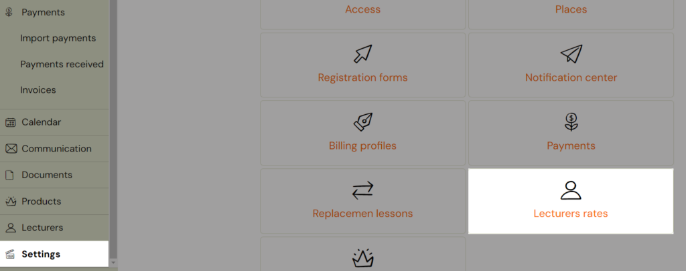
2. Then click the *Add Rate *button at the top of the screen
 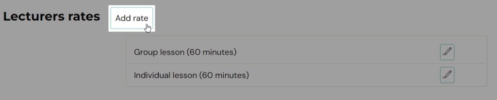
3. Enter a title, the duration in minutes, and then click *Add*.
 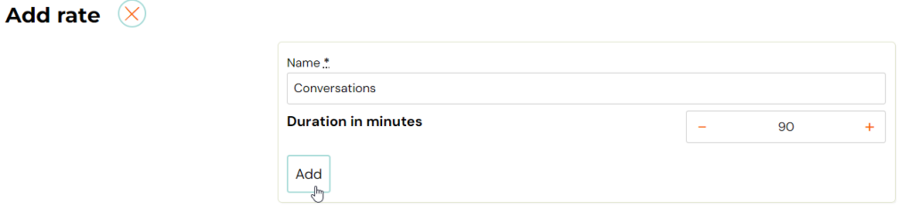

## 2. Determine the value of the rate

The created rates will be displayed for each instructor you have within your organisation. Then it’s up to you which one you use for a given instructor. You determine the price per rate for the instructor only in this step.

1. click on the *Instructors *tab and select a instructor
 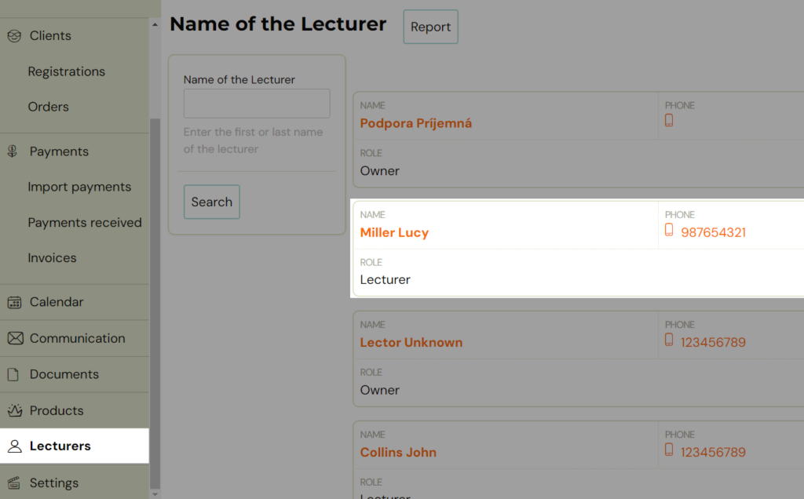
2. then click on the *Profile *tab
 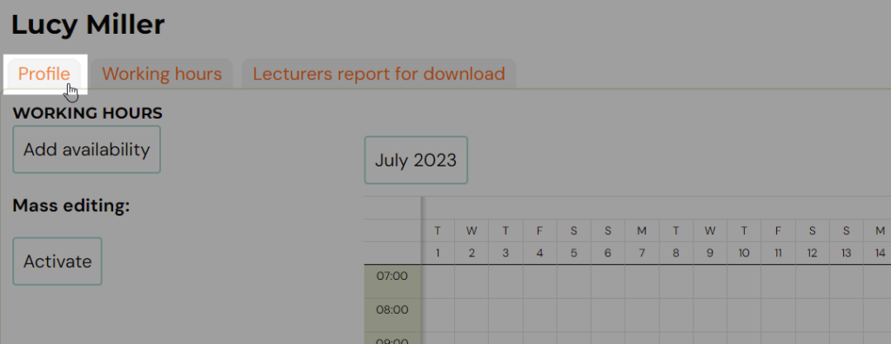
3. At the bottom of the profile, click on the *Pen *icon next to the rate you want to set for the instructor and enter the value (amount). Then click the *Save *button.
 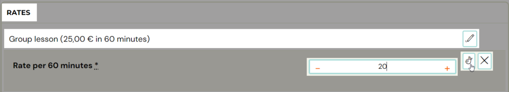

## 3. Setting the rate on the class

The rates so established still need to be determined at the class level in order for the class to be accounted for accordingly.

You enter the rate on the class as well as all other parameters (name, location, instructor…):

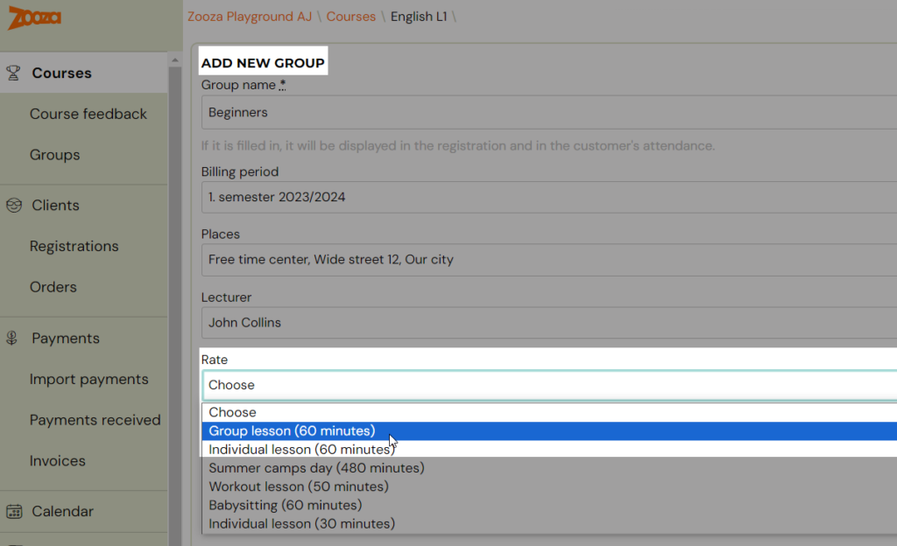

It is important to note that the above class rate will also apply to the additional class instructor if they are there. His rate may be different from that of the main instructor, but in order to calculate it well, it is necessary to have it defined for both instructors – see. step no. 2.
More information about the secondary instructors can be found in the tutorial.

## Adding rate to existing class

It you already have your class created, you still have the option to add a rate to the class. Find your class and edit the rate by clicking the *Pen *icon.

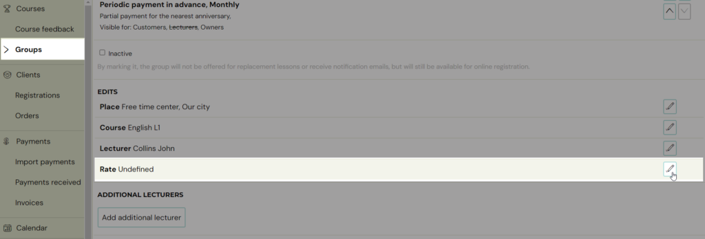

You can decide if you want to apply the changes to all terms or only for the upcoming ones.

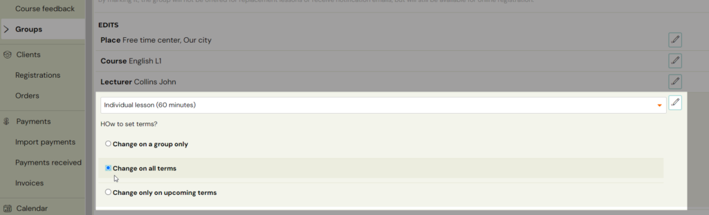

## Setting the rate on the term

You also have the option of setting the rate at the term level. You use this option in the following two cases:

1. If a term is led (substituted) by a different instructor than the one designated on the class and you want to designate a different rate for that instructor than the one designated on the class. You make this change on the term detail.
 
 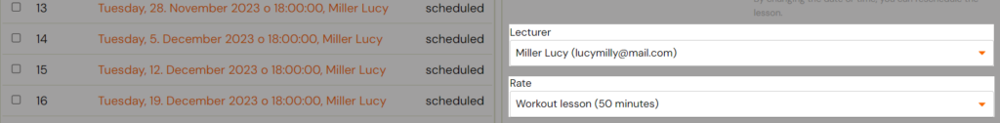
2. If a term has been cancelled and you still want to pay the instructor a remuneration. You make this change on the date detail via the compensation option. You specify the compounding of the reward as a percentage.
 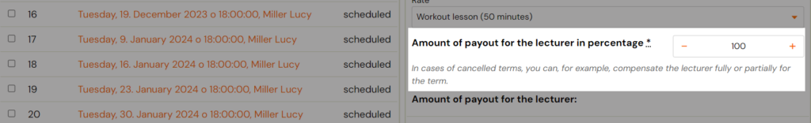

By default, this compensation is equal to 100%, i.e. the instructor receives 100% of the remuneration for the taught term. But when changing from a scheduled to a cancelled date, this value is automatically reset (the reverse automatic value change does not work, i.e. when changing from a cancelled to a scheduled date, the value does not return to 100%).

Note: If you use this functionality and you want to see the summary for cancelled sessions in the instructor’s report, you need to enable it within the instructor’s report. Because the reward report for cancelled appointments is not shown in the basic view.

## Create a instructor´s report

The instructor’s report serves mainly as an overview of the instructor’s work. In it, you can view data about the hours you’ve taken in a given time period. This report is thus the ideal basis for the creation of the monthly instructor’s remuneration. However, in order to use it as a basis for calculating remuneration, you must have defined rates for instructors.

To view the report, click *Instructors*, select the instructor and click the *Instructors report *tab.

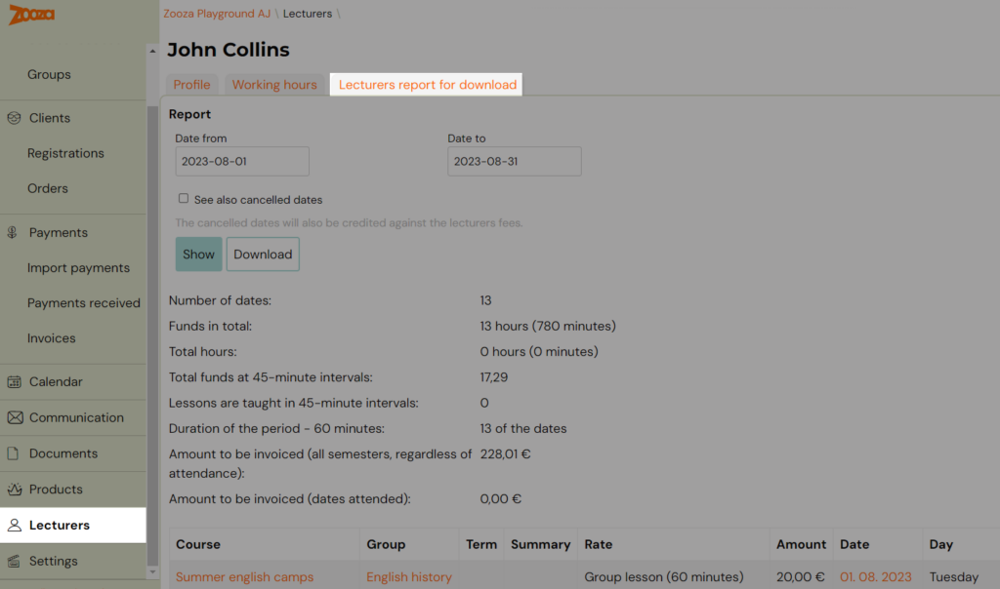

Define the time period, check the option to show cancelled appointments if necessary (the report will also show and count rewards for cancelled hours), and then click *Show *or *Download.*

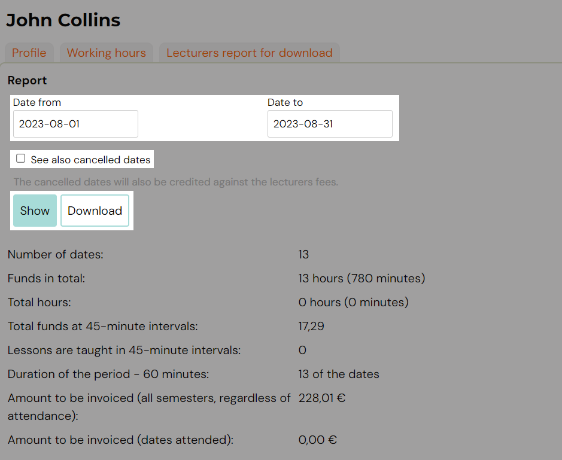

On this page you can see the total number of dates and amount to be invoiced. Also the list of all dates, with information about the programme, class, instructor´s rate, duration…

Don´t forget that everything orange in Zooza is clickable and can redirect you to the necessary page faster.

Here you can jump to the programme, class or to the required session.

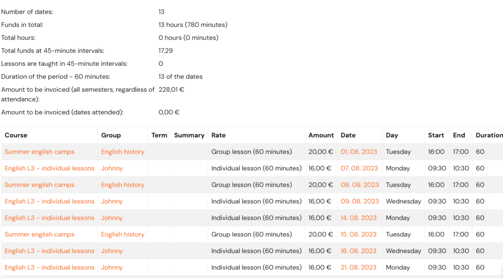
