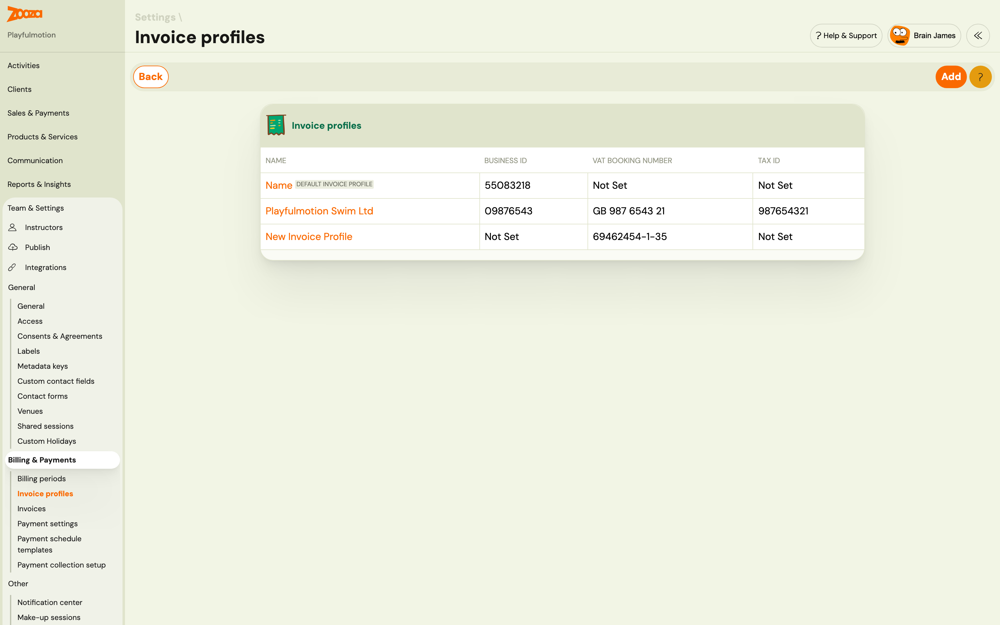
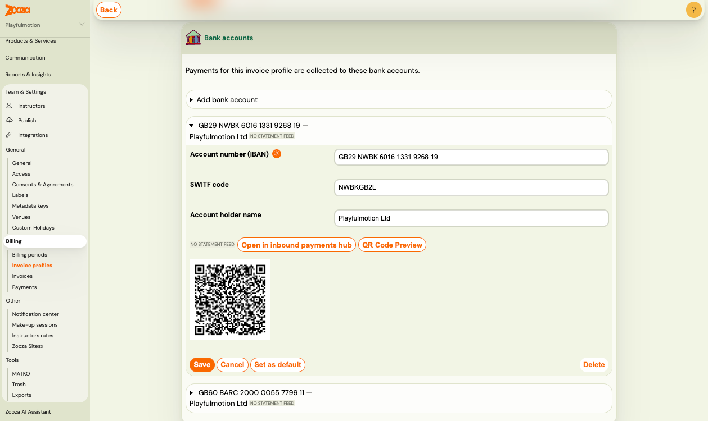
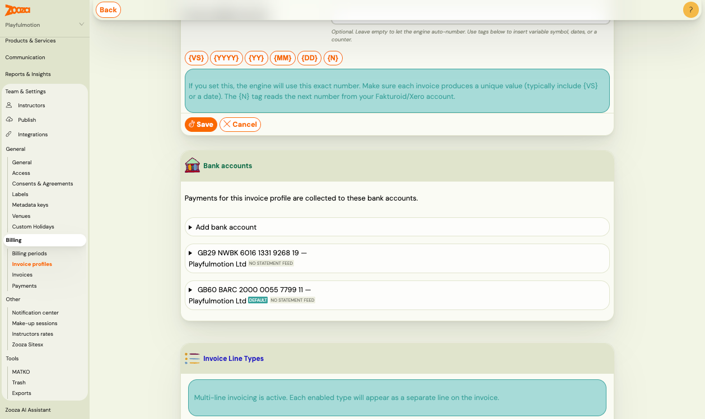

# Set up invoice profiles and bank accounts

An **invoice profile** is a legal entity — the "From" side of an invoice: company name, address, Business ID, Tax ID, VAT details and invoice numbering. A **bank account** is one IBAN that belongs to exactly one invoice profile. A profile can hold several bank accounts, and one of them is its default.

This split is what lets one Zooza company invoice under more than one legal entity, and lets one entity collect money to more than one account.

> **Navigation:** Settings → Billing & Payments → Invoice profiles
> **Permission:** Owner role (or an assistant with company-editing rights)

---

## How the two pieces fit together

| | Invoice profile | Bank account |
|---|---|---|
| What it is | A legal entity | One IBAN |
| Holds | Company name, address, Business ID, Tax ID, VAT number, invoice numbering, invoice engine settings | IBAN, SWIFT code, account holder name, statement feed |
| How many | One default per company, plus as many as you need | Several per profile, one marked as default |
| Appears on | The "From" block of every invoice | Payment instructions, QR codes, and bank-statement matching |

Zooza resolves both independently for every booking and order — which profile invoices, and which account collects. See [Choose which invoice profile applies](../guides/invoice-profile-overrides.md).

---

## Your invoice profiles

Go to **Settings → Billing & Payments → Invoice profiles**. The list shows every profile with its Business ID, VAT booking number and Tax ID. The company's own entity carries the **Default invoice profile** badge.

- Click a profile name to open it.
- Click **Add** to create another legal entity.
- The default profile **cannot be deleted** — it is the fallback used whenever nothing else is set.

Everything a company invoices under has to exist here first. If you only trade as one company, you will have exactly one profile and never need to think about this screen again.

---

## Bank accounts on a profile

Open a profile and scroll to the **Bank accounts** card:

> *Payments for this invoice profile are collected to these bank accounts.*

Each row is one account, labelled with its IBAN and account holder. Expand a row to edit it.

### Add an account

1. Click **Add bank account**.
2. Fill in `Account number (IBAN)`, `SWIFT code` and `Account holder name`.
3. Click **Save**.

The first account you add to a profile automatically becomes its default.

**The account holder name must match your bank exactly.** Banking apps verify it when a client scans a payment QR code, and EU instant-payment rules require the name and IBAN to match — a mismatch can make the transfer fail.

### One IBAN, one profile

The same IBAN cannot sit on two invoice profiles in the same company. If you try to save it a second time, Zooza rejects the change and explains that the account number is already used by another invoice profile. The form keeps what you typed, so you can correct it.

This is what keeps incoming payments unambiguous: when money lands on an IBAN, Zooza knows exactly which entity received it.

> If you had the same IBAN on two profiles before your account moved to the new model, that pair keeps working — existing duplicates are not broken retroactively. New ones are rejected.

### Choose the default account

The default account is the one used whenever nothing more specific is set. Expand an account and click **Set as default** — the `Default` badge moves to it.

### Delete an account

Expand the account and click **Delete**.

- You **cannot delete the default account** while the profile has other accounts. Set another account as default first, then delete.
- Deleting a profile's **last** account is allowed — the profile then simply has no account to collect to.

### Preview the QR code

Click **QR Code Preview** on an account to see exactly the payment QR your clients get for that account. Each account has its own — this is the fastest way to check that a newly added IBAN produces a scannable code.

### No account number or QR code on the client's payment

**Symptom:** a parent opens a payment in their client profile and there is no bank
account and no QR code to pay with. Registration otherwise works normally, so it
usually surfaces as a parent complaint rather than anything you would notice yourself.

**Cause:** the invoice profile that applies to that booking has **no bank account
filled in**. The most common way this happens is that someone added a new invoice
profile, and the bank account on the default profile was cleared in the process.

**Fix:**

1. Go to **Settings → Billing & Payments → Invoice profiles** and open the profile that applies
   to the booking. If you are not sure which one that is, see
   [Choose which invoice profile applies](../guides/invoice-profile-overrides.md).
2. Fill in the bank account — `Account number (IBAN)` and `Account holder name`.
3. **Fill in the `SWIFT code` as well.** The account number will show without it, but
   **the QR code only appears once the SWIFT code is there.** This is the step people
   miss, and it is why an account can be filled in and still produce no QR.
4. Repeat for every other profile you actually collect money to.
5. Reload a payment in the client profile to confirm both the account and the QR are back.

> Check this whenever you add a second invoice profile, and check it the same day —
> until it is fixed, every client sent to pay by transfer has nothing to pay to.

---

## Connect bank statements to an account

Each account can read its own bank statements, so Zooza can match incoming transfers to bookings. The connection lives on the **account**, not on the profile — a profile with two IBANs has two independent connections.

Click **Open in inbound payments hub** on an account, or go to **Settings → Billing & Payments → Payment collection setup**. Full steps: [Set up how Zooza collects money from clients](./inbound-payments-setup.md).

---

## Where the resolved profile and account are used

Once your account is on the new billing model, the same answer is used everywhere:

- the "From" block and numbering on generated invoices,
- the IBAN and QR code in payment instruction emails,
- the payment details shown in the booking widget,
- matching of incoming bank transfers and direct debits,
- per-entity turnover figures.

Previously these could disagree — a client could see one IBAN on the emailed QR code and a different one on the invoice. They now always agree.

> **Rollout:** companies move to the new billing model one at a time, as their existing data is checked and reconciled. Until your account is switched, your billing screens work exactly as before.

---

## Related

- [Choose which invoice profile applies](../guides/invoice-profile-overrides.md) — inherit, override, and where each level is set
- [Billing and invoicing](./billing-and-invoicing.md) — invoice generation, numbering and templates
- [Invoicing in Zooza — overview](./invoicing-overview.md) — invoice engines and what Zooza does for you
- [Set up how Zooza collects money from clients](./inbound-payments-setup.md) — payment channels and bank statement reading
- [Payments and Billing FAQ](../faq/payments-and-billing-faq.md)
