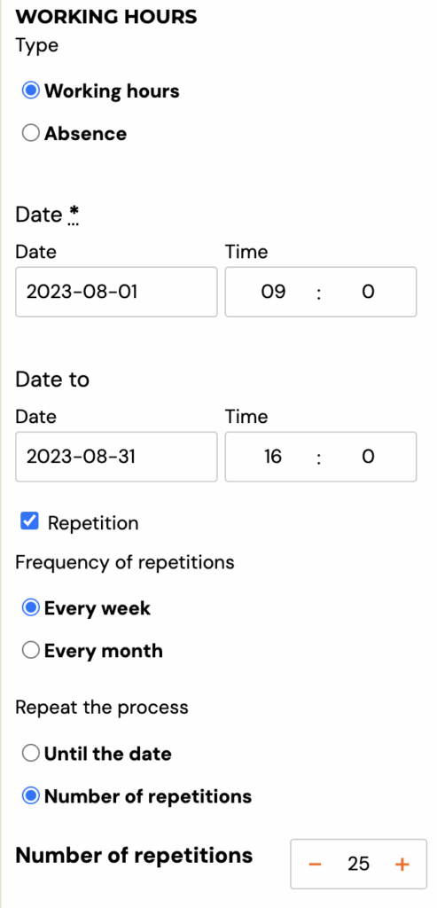
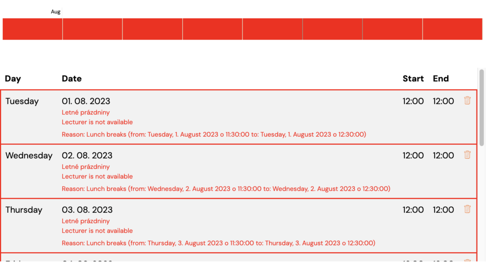
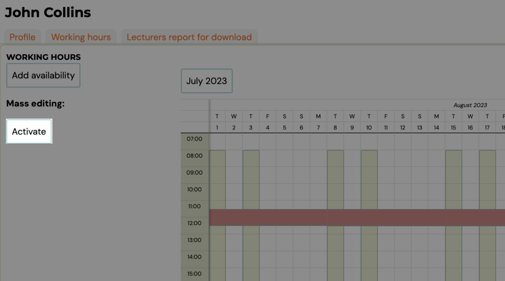
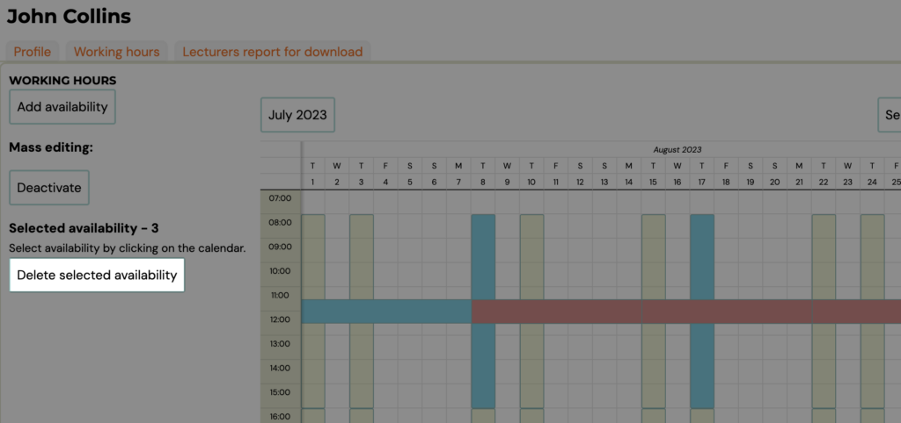

# Lecturers working hours

In the *Lecturers *section, lecturers can manage their working time. If they define their working hours and possible absences, this data will then be taken into account by the system when scheduling terms.

Example: Alice works Tuesdays to Fridays from 9:00 to 16:00 with an hour lunch break.

## 1. Setting working hours

- In the application, she clicks on the *Add Availability* button
- As the type selects *Working Hours*
- Selects a date range. In our example we choose 4th. January to 7th. January.
- As the time range selects 9:00 to 16:00
- She activates repetition at a weekly frequency. Depending on how long such working hours will be valid, the number of repetitions will be chosen.

- On the calendar in the app, availability will be displayed as follows:

## Step 2 - Lunch break

- Since Alice goes out for lunch in the middle of the day, she needs to tell the system that she doesn't work then.
- Again clicks the *Add Availability* button
- This time she selects the *Absence* option and enters the same data as before, except that the time period will be from 11:30 to 12:30
- She chooses the name of this absence: lunch break.
- The resulting calendar will look like this:

## How availability works when creating terms

From now on, when scheduling terms, the app will inform the admin that Alice is unavailable for appointments at lunchtime.

## Mass deleting of availability/absences

Since the availability of tutors can change frequently in the application, you have the option of mass deletion. This allows you to edit faster.

1. In the lecturer's details under *Working hours*, click *Activate*.
 
2. Select the availability/absences you want to delete by clicking on them and click on the *Delete selected availability* button.

Note: You can only do a mass deletion within one month. If you move to the next month, your previous withdrawal will be cancelled
