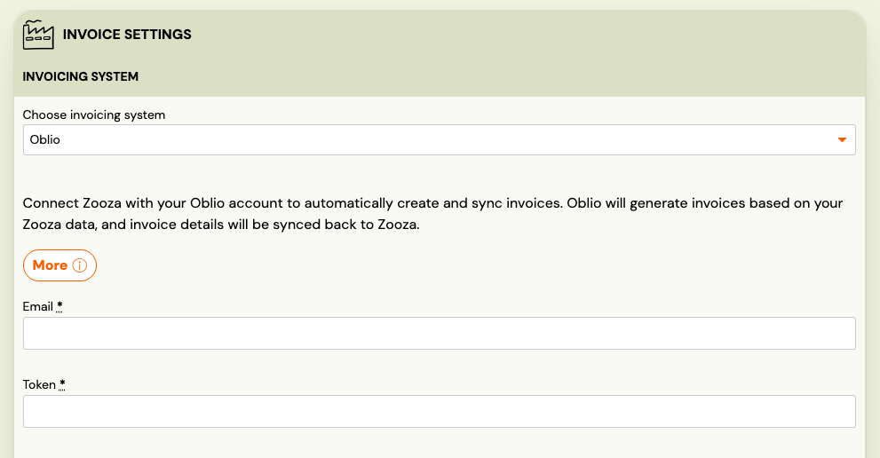

# Oblio Integration

Oblio is a Romanian cloud accounting platform. When connected, Zooza creates invoices directly in your Oblio account, which automatically submits them to ANAF (Romania's tax authority) — no manual filing required.

**Market:** Romania
**Setup effort:** Enter credentials + document series

---

## Before you start

You need an active [Oblio](https://www.oblio.eu/) account with at least one **document series** created. The document series must exist in Oblio before you configure it in Zooza — invoice creation will fail without it.

---

## Setup

1. Go to **Settings → Billing** and open your Invoice Profile.
2. In the **Invoice Engine** section, select **Oblio**.
3. Enter your **Oblio email address** and **API token**.
   - Find the API token in your Oblio account under **Account settings → API**.
4. Enter the **Document Series** — this controls invoice numbering. It must already exist in your Oblio account.
5. Click **Save**.

---

## How invoices work

Once connected:

- Every time a payment is recorded in Zooza, an invoice is created in your Oblio account.
- In production, Oblio automatically submits each invoice to **ANAF** — you are legally compliant without any manual steps.
- The connection refreshes automatically — no periodic re-authorization needed.
- PDF is available for download after the invoice is created.

---

## What works and what doesn't

| Feature | Status |
|---|---|
| Invoice creation | ✓ Automatic |
| ANAF submission | ✓ Automatic in production |
| PDF generation | ✓ Available after creation |
| Re-authorization | Not needed — connection refreshes automatically |
| Credit notes | ✗ Not supported — issue in Oblio directly |
| Editing invoices after creation | Edit in Oblio — changes sync back to Zooza only after a manual refresh |

---

## Known issues

**Document series not configured** — If no document series is set, invoice creation will fail with an error. Make sure you create a series in Oblio first, then enter it in the Zooza Invoice Profile settings.

**Test environment** — Oblio has a test environment. Invoices created there are not submitted to ANAF. Confirm your setup works in test before switching to production credentials.

---

## Related

- [Invoicing overview](./invoicing-overview.md) — how invoice engines work
- [Billing and invoicing](./billing-and-invoicing.md) — Invoice Profiles, auto/manual generation, multi-line
- [Invoices list](../reference/invoices-list.md) — browsing and downloading invoices
