# Online registration

To control how the programme is displayed on your website and how communication with clients is managed, use this setting. It includes three parts:

1. Online registration
2. Customizing the booking form
3. Communication

## Online registration

## Booking options

In the* Booking options* section you set the visibility on your website and in the booking form.you can control what is visible on your website and in the booking form. If your programme includes a *Trial *or *Blocks*, you can decide exactly what you want clients to see.

Example: If you don’t want clients to choose between blocks and the full programme, select the *Blocks only* option.

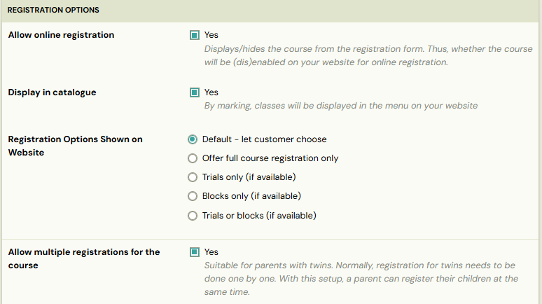

## Multiple bookings for the programme

When you enable multiple bookings for a programme, you can choose whose information you need to collect — only from the main registrant or from every participant.

We also recommend selecting the *Payments are managed by registrant *option in the *Price and Payment *tile. This ensures that all payments for the bookings are grouped under the main booking, using a single variable symbol, and allows clients to pay everything in one transaction.

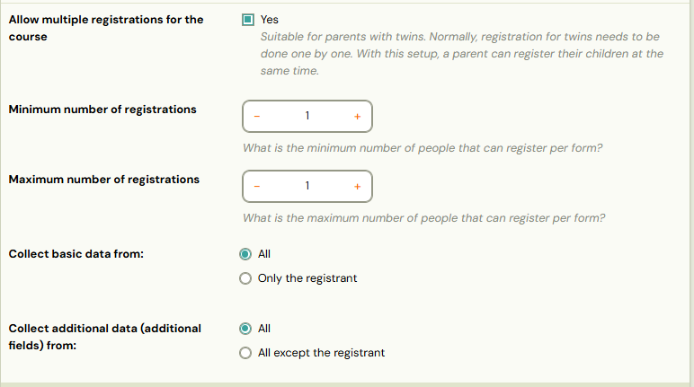

## Other

These settings let you control how long classes remain visible in your booking form in the following situations:

1. When a class reaches capacity – choose whether it should still appear or be hidden.
2. Before the programme starts – set the number of hours in advance when the programme should be hidden from your website’s programme catalogue.

Alert: Hiding the programme before it starts will disable the option to allow late booking in the Price and Payment tile.

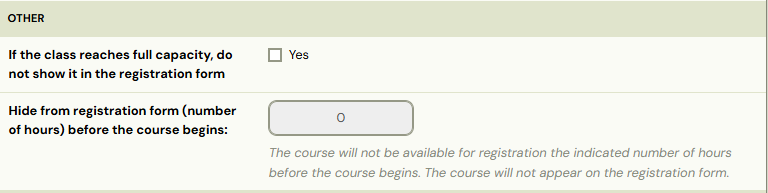

## Class settings

Here, you can choose which classes from your list should appear in the menu on your website as available for online registration. This is especially useful when launching a new set of classes and you want to open online registration for multiple classes at once.

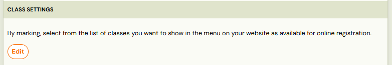

## Customizing booking form

If you need different field names for this programme’s booking form, you can set them in the *Customizing the Booking Form *section. This is useful when certain programmes require specific field labels that differ from your standard booking form.

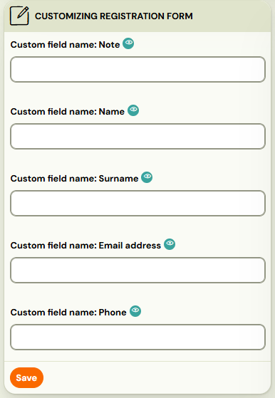

## Communication

Communication plays an important role throughout the programme. Each booking type has its own specific communication settings, in addition to a standard set of email templates you can use.

## Email templates and signature

Select which templates to use for:

1. Confirmation email
2. Lead collection confirmation
3. Session reminders
4. Preset signature

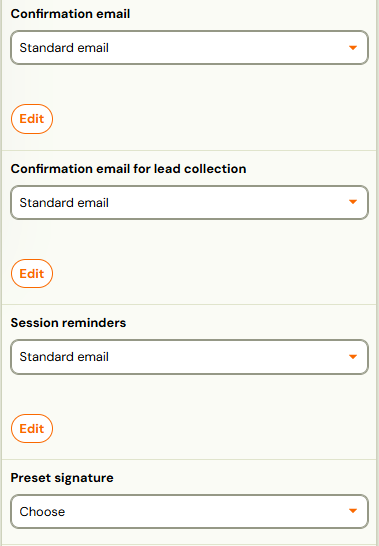

Info: Information about how to work with email templates is available in this [manual](../guides/message-templates.md).

## Automatic email reminders

Choose whether the system should send a reminder to participants the day before each session.

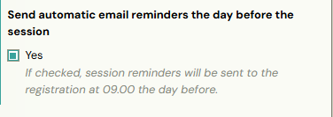

Note: The exact time the reminder email is sent can be configured in the message template * Automatic session reminder*.

## Notification about upcoming sessions

For *Pay-as-you-go programmes* only, Zooza provides an additional email notification for upcoming sessions with available slots possible for booking.

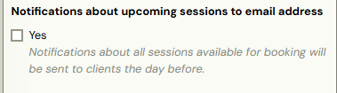

Note: This template is to be found in Message templates as* Upcoming Session Notification *template.

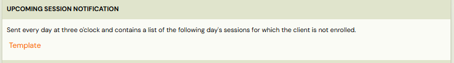

## Notification to waiting lists about available slot

If your *one-session programme *is full and you allow clients to join a waiting list, you can set up an automatic notification to inform them when a spot becomes available due to a cancellation.

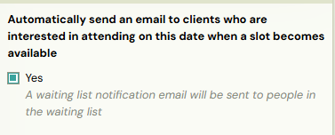

Note: This template is available in message templates as *Automatic waiting list notification.

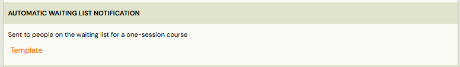

*
