# Power BI integration

Zooza offers a professional, self-service reporting solution using PowerBI that lets you generate and customize your own reports, giving you the flexibility to explore Zooza data from any angle you need.

There are 2 parts in the integration:

1. Activate SAS token in Zooza application
2. Connect to Zooza data via PowerBI desktop (Windows users) or Microsoft Fabric in web browser (Mac, online solution).

## 1. Activate SAS token in Zooza

To begin using and transforming raw data from Zooza into PowerBI report, you need to enable PowerBI integration by clicking the *Activate* button in the *PowerBI Integration* tile under the *Reports* section of the Zooza application.

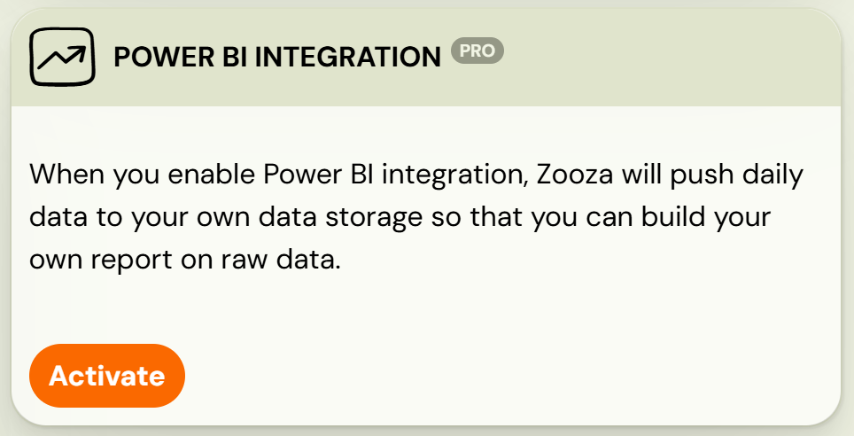

Once activated a URL link and SAS token will be displayed. You will need both for the next step in the setup process.

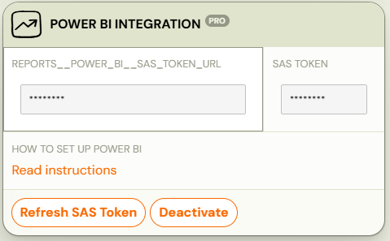

## 2. Power BI integration

## Power BI desktop

For Windows users, you can download and install the Power BI Desktop application to create and run reports directly on your local machine. To connect to data hosted in Zooza, follow these steps:

1. Open PowerBI DesktopIf you have not already installed it, download the latest version from Microsoft’s site and complete the installation.
2. Click on Get data - This opens the full list of data-source options.
 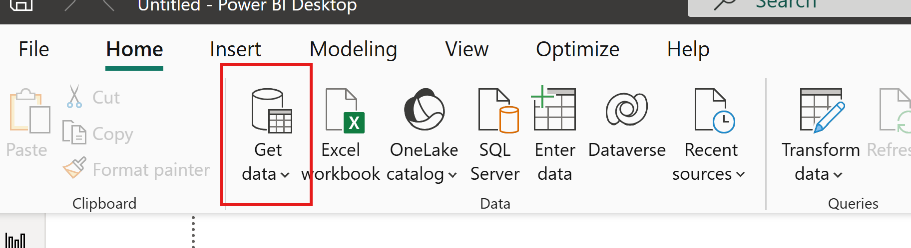
3. Find *Azure Data Lake Storage Gen2* and click Connect
 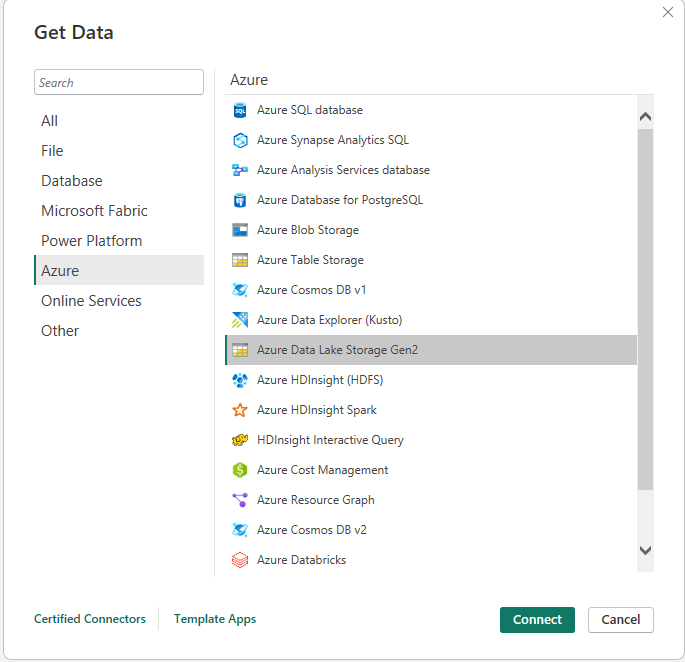
4. When prompted, paste the Zooza URL provided to you in Zooza app
 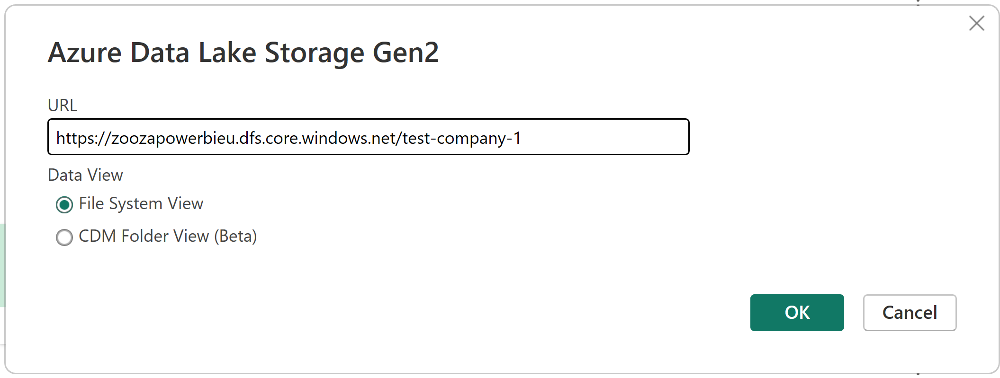
5. Provide your SAS token as credentials
6. Copy the SAS token in Zooza
7. Back in PowerBI, paste the token you copied from Zooza (labeled as Shared access signature (SAS)) and click Connect
 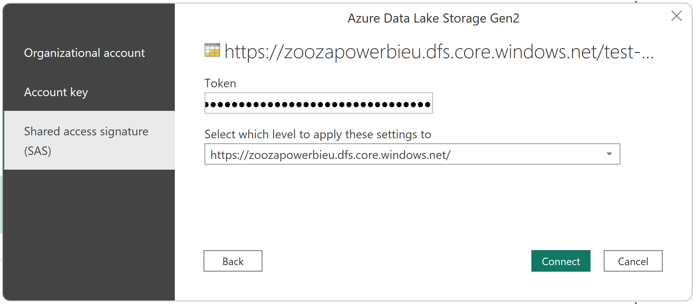

If the connection is successful you will be able to see a preview of your data you can work with. You can either:

1. Click on Transform Data to launch Power Query and shape/clean your data before loading.
2. Click Create (or Combine) if you are loading multiple files/folders to import the data immediately and begin building reports.
 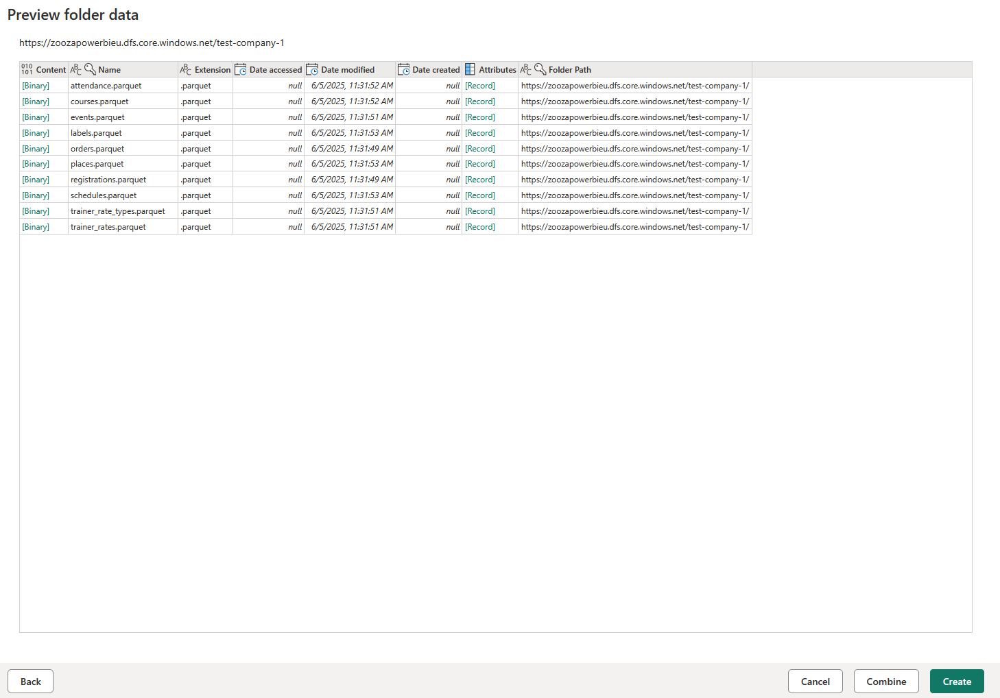

Detailed information about the structure and meaning of Zooza’s data can be found in manual [Power BI Data description](../guides/power-bi-data-description.md)*. *

## Microsoft Fabric

If you do not want to have a desktop version or you are a Mac user (there is no Power BI desktop version), you can use the online version app.powerbi.com with the use of Microsoft Fabric. It is quite simple to create an account with your email address. All information on how to sign up or work with this version of Power BI can be found in this [link](https://learn.microsoft.com/en-us/power-bi/fundamentals/service-self-service-signup-for-power-bi).

In short, these are the steps you need to follow in order to have data from Zooza stored and ready for your report creation:

1. Create New Workspace (for better share management)
2. Create Lakehouse
3. Create Dataflow Gen 2 inside Lakehouse

### Workspace

First, create a workspace to easily share your reports with colleagues. Once your Power BI account is set up, you can create a new workspace from the left-hand pane.

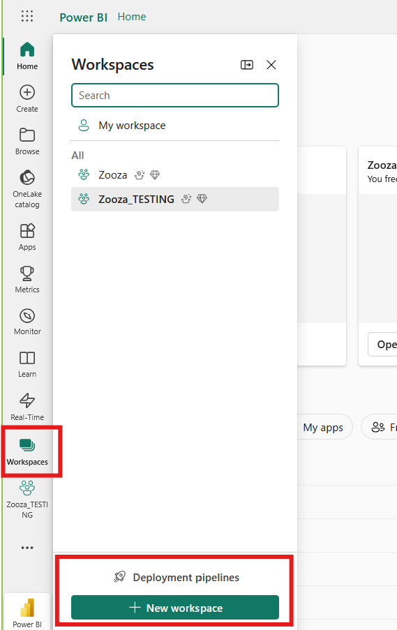

### Lakehouse

The next step is to create a lakehouse in your new workspace. A lakehouse stores all your data in a single location providing greater flexibility and simplifying data management. More information is available [here](https://learn.microsoft.com/en-us/fabric/data-factory/create-first-dataflow-gen2).

1. To create a lakehouse, click New Item in your workspace and select Lakehouse.
 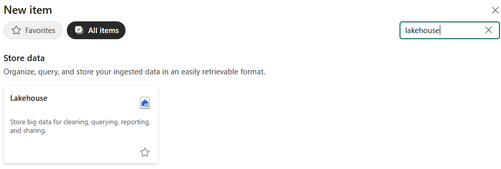
2. Once the Lakehouse is created, you will be directed to a new screen where you can proceed with the next step.

### Dataflow

The next step is to retrieve and store data from Zooza by creating a *New Dataflow Gen2*. This will allow you to build your data model using Zooza’s data connection.

1. In your workspace, click New Dataflow Gen2 on the screen.
 
2. After clicking the dataflow, go to the Home tab and click *Get Data.*
 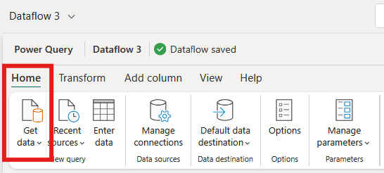
3. Choose* Azure Data lake Storage Gen2* as the data source.
 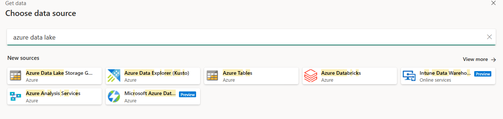
4. Copy and paste the URL and SAS token provided in Zooza application after activating Power BI integration.
5. Paste the URL in the *Connection settings.*
 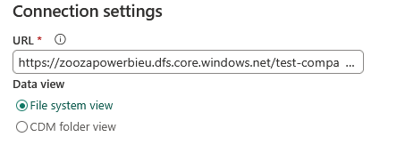
6. In *Connection Credentials* change the *Authentication kind* to* Shared Access Signature (SAS).*
 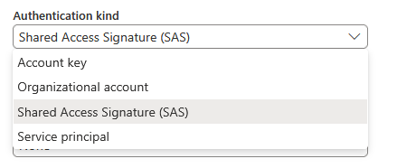
7. Copy the SAS token from Zooza and paste it to the SAS token field and click Next.
 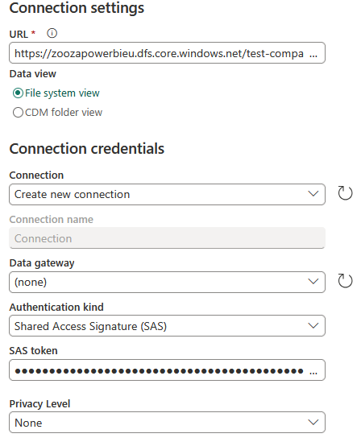
8. If the connection is successful you will see a preview of folder data that needs to be combined together into a data model. Detailed information about the structure and meaning of Zooza’s data can be found in manual [Power BI Data description](../guides/power-bi-data-description.md)*. *You can add as many tables as you need to your Dataflow and transform them with Power Query.*
 
 *
9. In the *Query Settings* pane on the right side of the screen you can:
10. Track all changes made to your table
11. View the* Data Destination*, where you will see that the data is being saved to the Lakehouse. If your Lakehouse is not visible as a destination, click the plus (+) icon to manually assign it.
 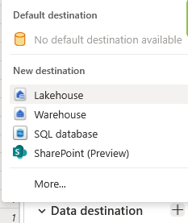
12. Click *Publish *to save your data model into a* SQL Semantic Model*, which will serve as the foundation for visualizing your data. Once the semantic model is published and refreshed, you can continue editing the data model by navigating to the lakehouse folder and clicking on the *SQL analytics endpoint.* From there, you can connect, merge, append tables or create calculations using or DAX.
 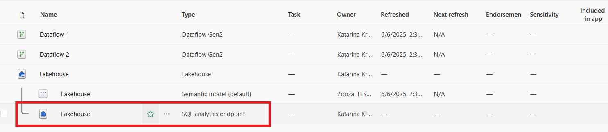

If no further changes are needed, go to the Reporting tab and click New Report to begin visualizing the data provided in Zooza.

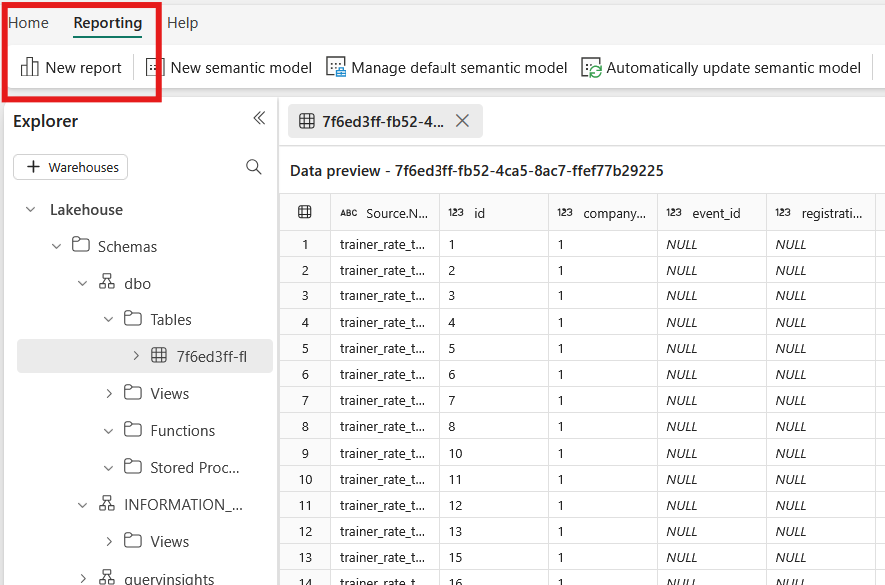
