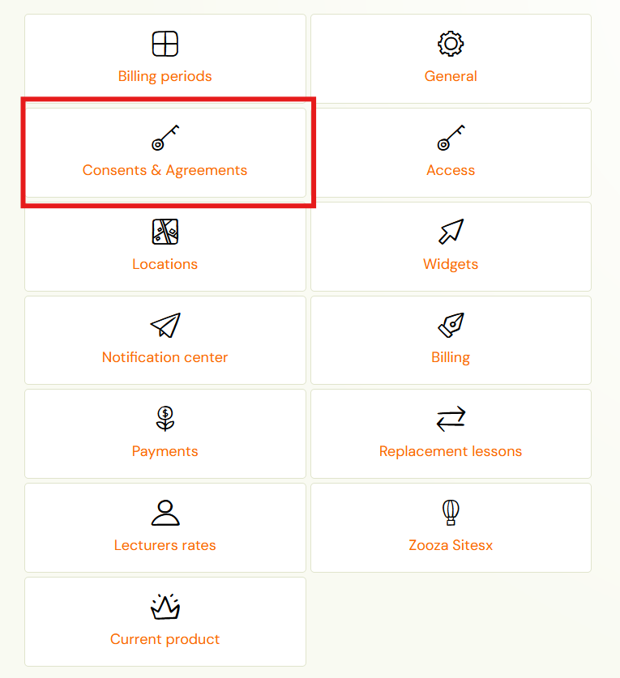
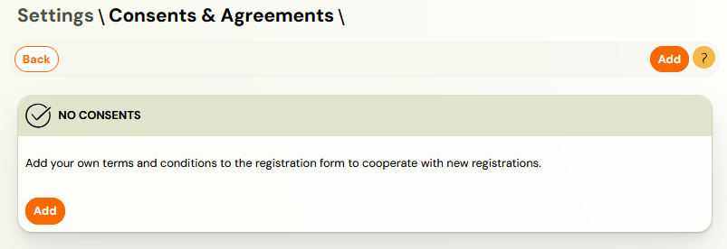
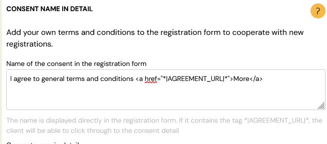
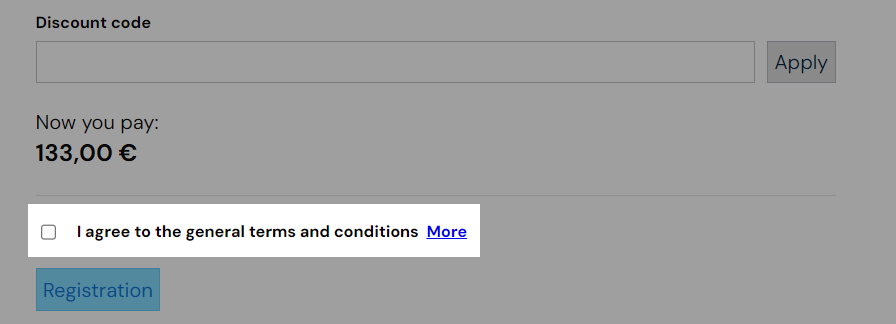
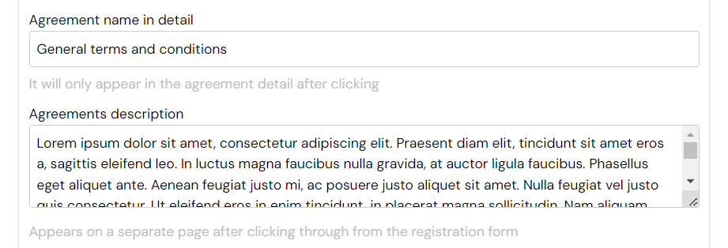
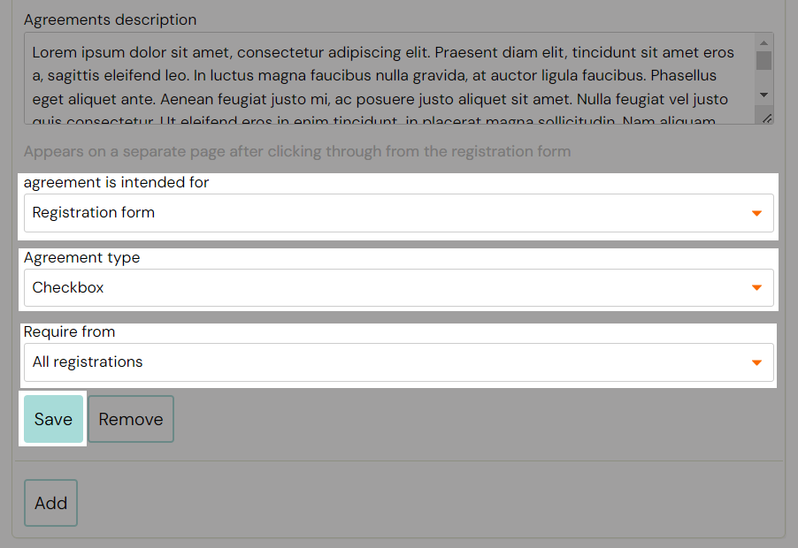

# Setting GTC, GDPR and other consents

When registering clients for a course, it is necessary for clients to
 agree to various consents, such as terms of business or consent to the
processing of personal data. All important and legally necessary matters
 that you simply must have settled and signed with your clients.

You can insert approvals for each course separately and even tell what and how to display where.

1. To set it up, go to *Settings – General Settings*.
 
2. Scroll down to *Agreement name in detail*, click *Add* to add a new one. Otherwise, just edit the already created one.
 
3. Click on the *Add *button and proceed as follows:

1. Agreement name in the registration form – how to
display the agreement under the registration form. Type your sentence
before the tag More
2. Leave this code in the field as it causes a separate page with the consent text to appear when your client clicks the *More* button.
 

Your sentence and the option to click on* More* button will appear in the registration form on your web page like this

1. Write your *Agreement name in detail* – what consent name should be displayed when the client opens the detail view after clicking on the link
2. Write your Agreements description – the full text of the consent, which is only displayed when you click the *More button*
 
3. When the client clicks on the More button a new page with Name and Description will be open

Note: If the consent text does not fit in the *Agreement description *field,
 you can insert a link to the page, where you have published the full
consent instead of the dynamic *|AGREEMENT_URL|* tag.

 4. At the same time, select its display settings:

1. Where you want to display the consent:
2. registration form
3. order form
4. inactive - will not be displayed

Obligation to consent:

1. without the need for a separate confirmation – means that by registering you also agree to the terms and conditions
2. check box, which must be ticked by the client
3. choice of yes or no – the client chooses the answer whether he agrees or not

Requiring from – who you are asking for approval from:

1. from all registered – consent will always be displayed regardless of the course
2. only for selected courses – consent will only be displayed for courses you select from the list

If you want to add more agreements click on the *Add* button and repeat the process.

Note: If you want the same consent to appear on the registration and product forms, you need to create two identical entries.

Do not forget to save your settings at the bottom of the page as well.
