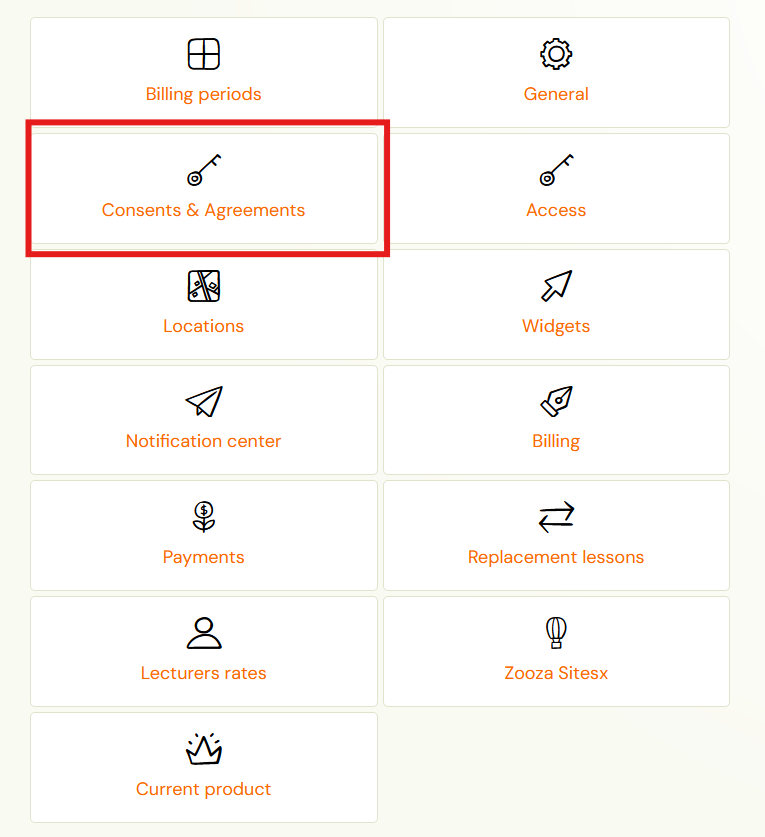
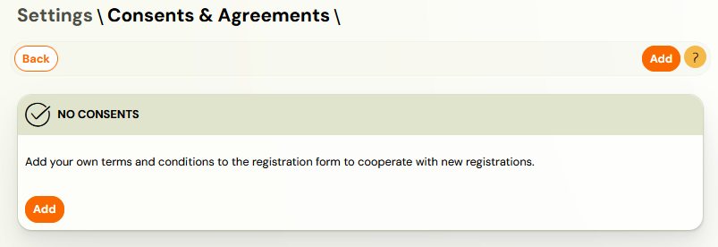
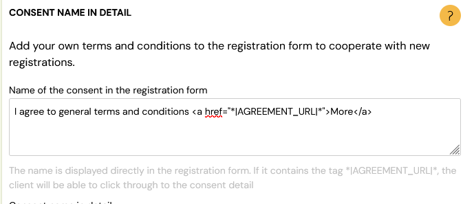
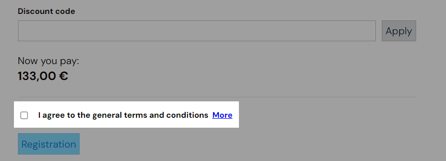
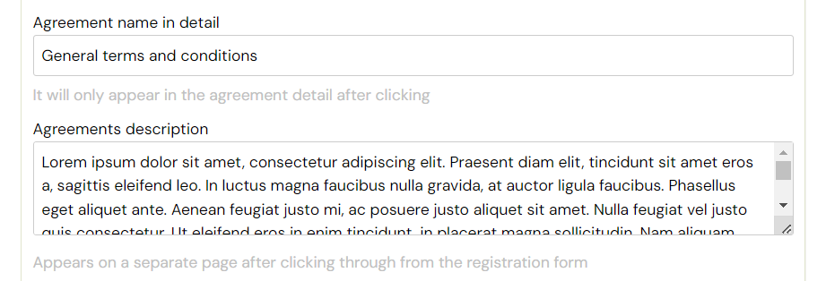

<!-- Synonyms: terms and conditions, GTC, GDPR consent, consent booking form, agreement registration, add consent, terms of service, marketing consent, data processing consent, szerződési feltételek, GDPR beleegyezés, regisztrációs feltételek, hozzájárulás, adatkezelési beleegyezés, podmienky zmluvy, GDPR súhlas, súhlas pri registrácii, obchodné podmienky, súhlas na spracovanie osobných údajov -->

# Consents and agreements (GTC, GDPR)

Zooza lets you add consent checkboxes or agreements to your booking and order forms — for example, terms and conditions, GDPR data processing consent, or marketing opt-in. You can configure each consent separately, choose how it is displayed, and limit it to specific programmes.

Consents given by clients are stored on their profile with a timestamp and version number.

## Where to find consent settings

Go to **Settings → Consents & Agreements**.



The list shows all configured consents. Each card displays:

- The consent name
- Where it appears (**Booking form** or **Order form**)
- The consent type (Check box, Yes or No, or automatic)
- Filter buttons to browse bookings by consent status

Click **Add** to create a new consent, or **Edit** on an existing card to modify it.

## Creating or editing a consent



### Consent name in detail

The internal name displayed when the client opens the consent detail page (after clicking the link in the booking form). This is not visible on the form itself.

### Name of the consent in the booking form

The text displayed directly in the booking form. This is what clients see when registering.

If you want clients to be able to read the full consent text before agreeing, include the dynamic tag `*|AGREEMENT_URL|*` in this field as a link:

```
<a href="*|AGREEMENT_URL|*">More</a>
```

Zooza replaces `*|AGREEMENT_URL|*` with a link to the consent detail page. Clients click **More** to read the full text before confirming.

**Alternative — link to your own website:**
If your T&C are already published on your website, replace the tag with your URL directly:

```
<a href="https://yourwebsite.com/terms">Terms and Conditions</a>
```

In this case, the **Consent text** field below is not used.

### Consent text

The full text of the consent, shown on a separate page when the client clicks the link. Supports rich text (bold, lists, links). Leave this empty if you link to an external page instead.

### Consent type



| Type | How it works |
|---|---|
| **No separate confirmation needed** | Consent is implicit — by clicking the registration or order button, the client automatically agrees. No checkbox is shown. |
| **Check box** | A checkbox appears in the form. The client must tick it to proceed. |
| **Choose Yes or No** | The client explicitly selects Yes or No. You can filter bookings by which answer they chose. |

### Require from

Controls which bookings the consent applies to:

- **All bookings** — the consent appears on every booking form regardless of programme.
- **For select programmes** — the consent only appears for the programmes you choose from the list.



This is useful when some consents are only relevant for specific programmes — for example, a photo consent for in-person classes but not for webinars, or special T&C for summer camps.

## Filtering bookings by consent status

Each consent in the list has **Filter bookings** buttons. Click one to jump to the bookings list filtered by that consent status:

- **Has consent / No consent** — for checkbox-type consents
- **Accepted / Declined / No consent** — for Yes/No-type consents

This makes it easy to follow up with clients who have not yet given consent.

## Viewing consents on a client profile

All consents a client has given are recorded in the client detail under **Consents given by client**.



The table shows:

| Column | Description |
|---|---|
| **Consent** | The consent name (links to the full text) |
| **Consent version** | Version number (increments when you update the consent text) |
| **Consent version valid from** | When this version of the consent took effect |
| **Mandatory** | Whether consent was required |
| **Agreed** | Whether the client agreed (Yes/No) |
| **Type** | How consent was collected (Booking button, Checkbox, Yes/No) |
| **Date consent given** | Timestamp of when the client gave consent |
| **Revoke date** | If consent was revoked, when |

> **Note:** The consent record shows "These consents apply to all client bookings." — a consent given during any booking applies across the client's profile, not just that one booking.

## Consent versioning

Each time you make a significant change to the consent text, Zooza creates a new version. The version number and effective date are stored with each client's consent record. This provides an audit trail for GDPR compliance.

If you update the consent text and need clients to re-accept it, you will need to contact them separately — Zooza does not automatically prompt existing clients to re-consent when a new version is published.

## Related

- [Consents and Agreements FAQ](../faq/consents-and-agreements-faq.md)
- [Online registration](../setup/online-registration.md) — configuring the booking form.
