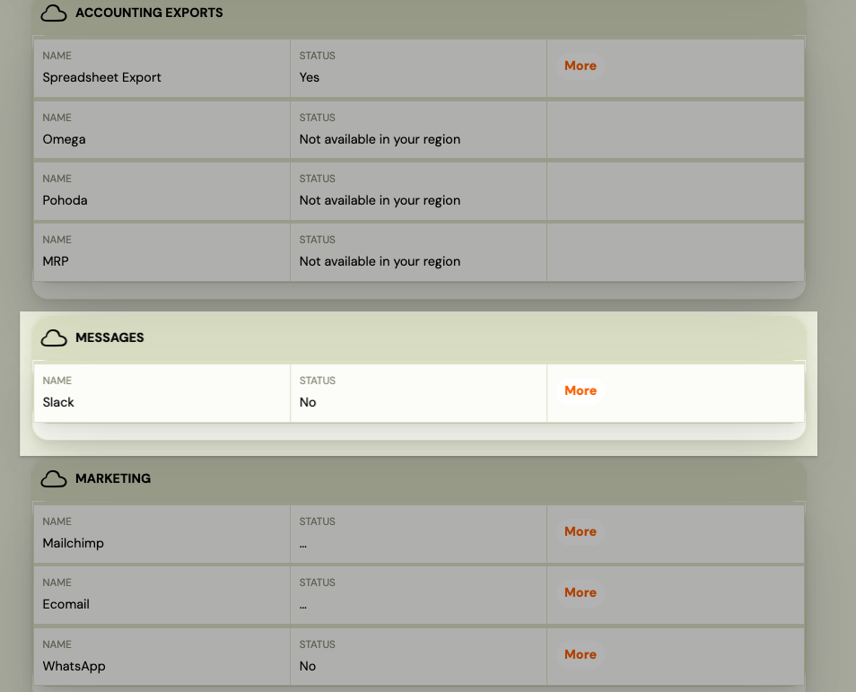
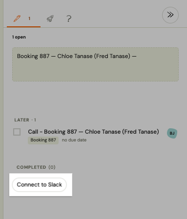
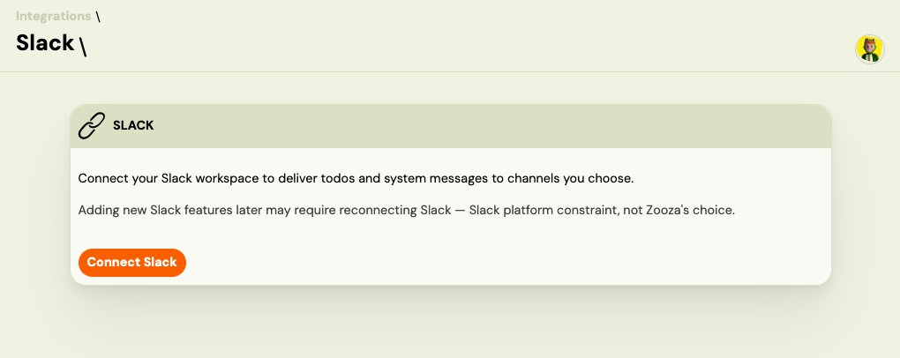
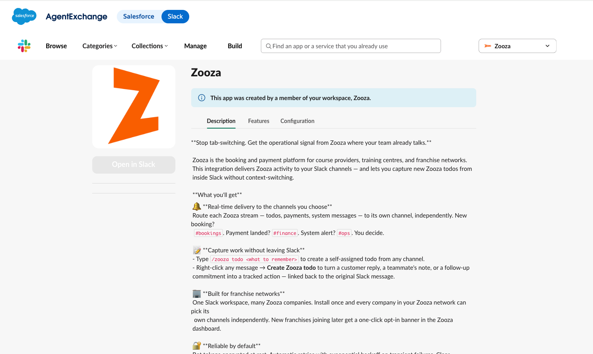
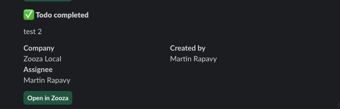

# Connect Slack to Zooza

Zooza can deliver notifications to Slack — todo assignments, system alerts, and other operational events — so your team gets updates without switching tabs.

**One Slack workspace install covers your entire network.** If your Zooza account is part of a franchise network, a single admin connects the shared Slack workspace once. Every other company in the network is attached automatically and only needs to configure which channels receive their notifications. If you are a standalone company (no network), the connection applies to your company only.

---

## Requirements

- You must have **Owner** or **Assistant** role in Zooza.
- You need permission to install apps in your Slack workspace (Slack workspace admin or app approval).
- The Zooza Slack App must be installed in your Slack workspace — this happens automatically during the OAuth flow below.

---

## Connect your Slack workspace

1. Go to **Settings → Integrations → Slack**.
2. Click **Connect to Slack**.
3. You are redirected to Slack. Review the requested permissions and click **Allow**.
4. You are redirected back to Zooza. The connection is active immediately.

**If you are part of a franchise network:** all companies in your network are now attached to this Slack workspace. Each company's admin can configure their own channel mappings independently — no further OAuth required for them.

**If you are a standalone company:** only your company is connected. Setup is complete.

---

## Configure notification channels

After connecting, you decide which Slack channel receives each type of notification. You configure this per notification stream:

| Stream | What it delivers |
|---|---|
| **Todos** | When a team member assigns a todo to a colleague, the assignee's notification appears in the configured channel. |
| **System messages** | Automated alerts — worker failures, payment errors, integration issues. |

To configure:

1. Go to **Settings → Integrations → Slack**.
2. Under **Channel mapping**, select a Slack channel for each stream you want to activate.
3. Leave a stream unmapped to disable Slack delivery for it.
4. Click **Save**.

> The channel list is fetched from your Slack workspace. If you do not see a channel, make sure the Zooza bot has been added to it (in Slack: open the channel → **Add apps** → Zooza).

---

## Network and franchise setup

When a network company installs Slack, the Zooza bot joins the shared workspace once. Each franchise unit then picks its own channels:

1. Franchise admin goes to **Settings → Integrations → Slack**.
2. The connection is already active (inherited from the network install).
3. Configure channel mappings for this location's streams.

No re-authorization is needed. If a new company joins the network after the initial install, they will see a prompt in **Settings → Integrations → Slack** to opt in.

---

## Manage the connection

### Disconnect your company

To stop Slack delivery for your company without affecting others in the network:

1. Go to **Settings → Integrations → Slack**.
2. Click **Disconnect this company**.

Your channel mappings are removed. The Slack workspace install and other network companies are unaffected.

### Uninstall (remove from the entire workspace)

Only the company that originally completed the OAuth can fully uninstall:

1. Go to **Settings → Integrations → Slack**.
2. Click **Uninstall**.

This revokes the Zooza bot from Slack and deactivates the connection for all attached network companies.

---

## What gets delivered to Slack

Zooza only sends a Slack notification when an in-app notification would also fire. Events that are silent in-app — for example, assigning a todo to yourself, or completing your own todo — are also silent in Slack.

Each Slack message includes:
- The todo message or system alert text
- Company name (useful in network setups with a shared channel)
- Created by / Assigned to
- Due date (if set)
- A **Open in Zooza** link that takes you directly to the relevant record

---

## Troubleshooting

**Messages stopped appearing in Slack**
The Slack bot token may have been revoked (e.g., a workspace admin removed the Zooza app, or another OAuth was completed for the same workspace from a different Zooza network). Go to **Settings → Integrations → Slack** — if the status shows **Needs re-authorization**, click **Reconnect** and complete the OAuth flow again.

**Channel not listed**
The Zooza bot must be a member of the channel. In Slack, open the channel, click the channel name at the top, go to **Integrations → Add apps**, and add Zooza.

**"Another network already has this workspace"**
Each Slack workspace can only be connected to one Zooza network. If a second Zooza network tries to install into the same Slack workspace, the install is blocked. Contact support if you believe this is an error.

---

## Related

- [Use Zooza from Slack](../guides/zooza-in-slack.md) — create todos and use slash commands directly in Slack
- [Slack FAQ](../faq/slack-faq.md)
- [Integrations overview](./integrations-hub.md)
