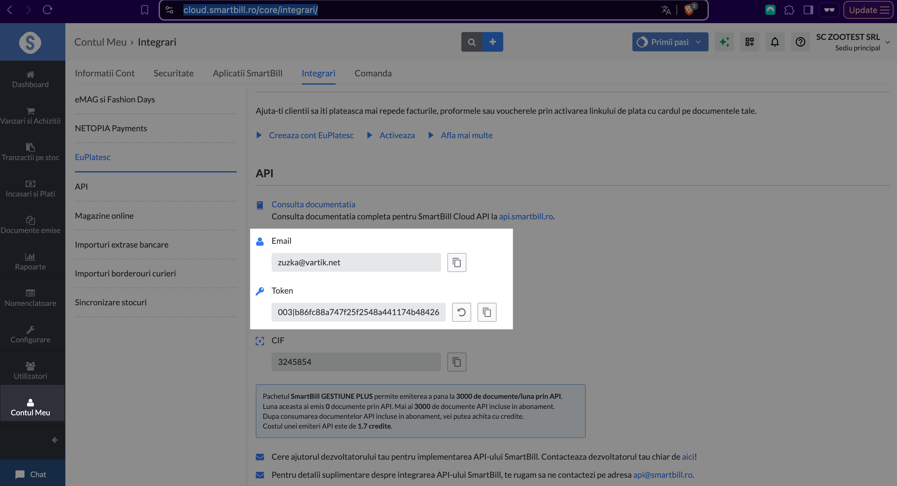
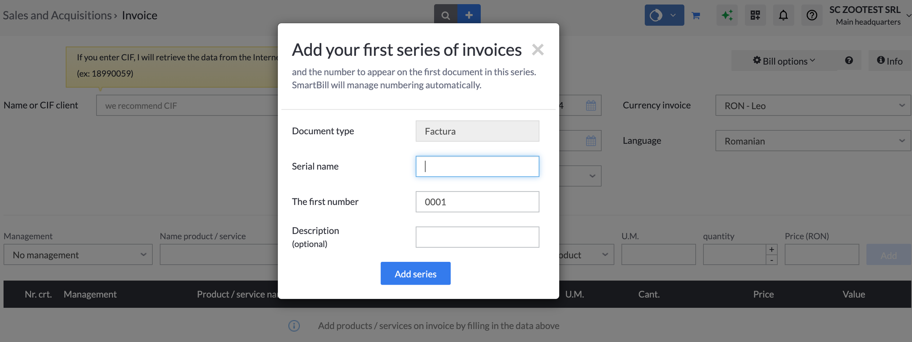
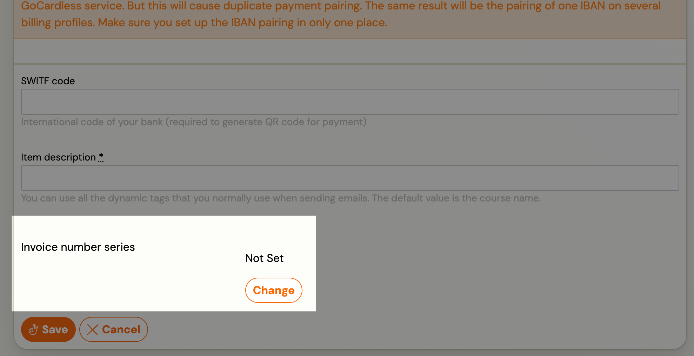
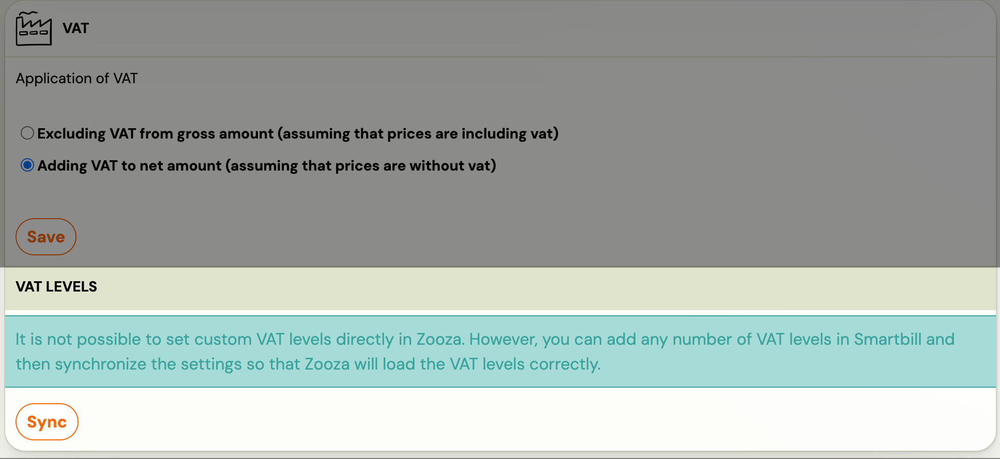

# Smartbill - invoice management

Integration to the Smartbill billing system used in Romania.

[Program Facturare Online | Gestiune si Contabilitate | SmartBill](https://www.smartbill.ro/)

Connection to the service allows you to create invoices in the direction of Zooza – Smartbill.

## Functioning of the invoice management process and billing profiles when connected

1. The number of invoices issued depends on the prepaid package in Smartbill
2. VAT settings are pulled from Smartbill towards Zooza
3. The number series for invoices is set in Smartbill
4. Already created invoice can only be changed or deleted in Smartbill, no back-synchronization is possible – after editing an invoice in Smartbill, the current form of the invoice is not pulled into Zooza, Zooza communicates this directly on the invoice by flag/notice
5. Invoice data displayed in the invoice is set in Smartbill
6. Invoice data that is sent in communication with the client and in the client profile is set in Zooza

## Smartbill link – step by step

1. In Zooza, select Billing System – Smartbill along with:
2. Smartbill email address
3. Token that you find in SmartbillSection My account – Integrations – API
 

Choose whether you want automatic generation of invoices or you will manually generate invoices per booking

Set up Billing profile/s for communication from Zooza
Link your billing profile to the GoCardless app for automatic payment pairing - [Billing and invoicing](billing-and-invoicing.md)
Set the number series for invoices in Smartbill

In the billing profile detail in Zooza, select the number series that will be used for the billing profile

Set VAT levels in Smartbill
In the VAT levels settings section of Zooza, select from the options how to apply VAT levels and click on the synchronize option so that the levels are properly tightened

