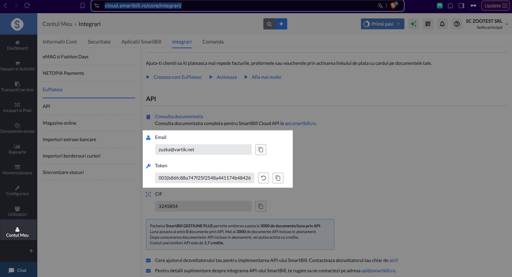
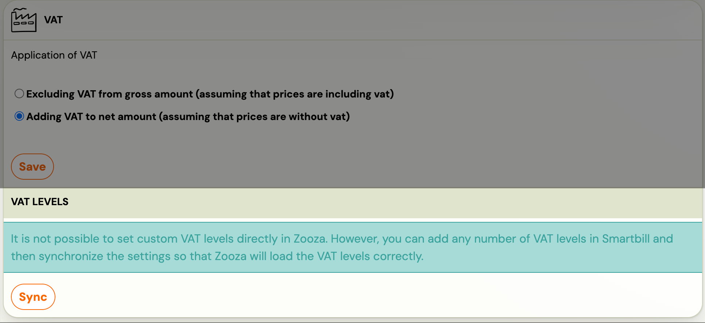
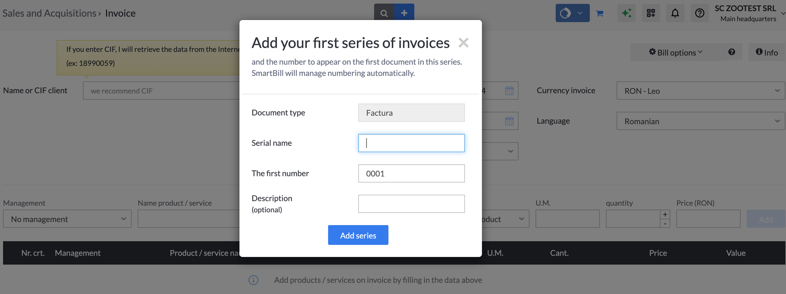
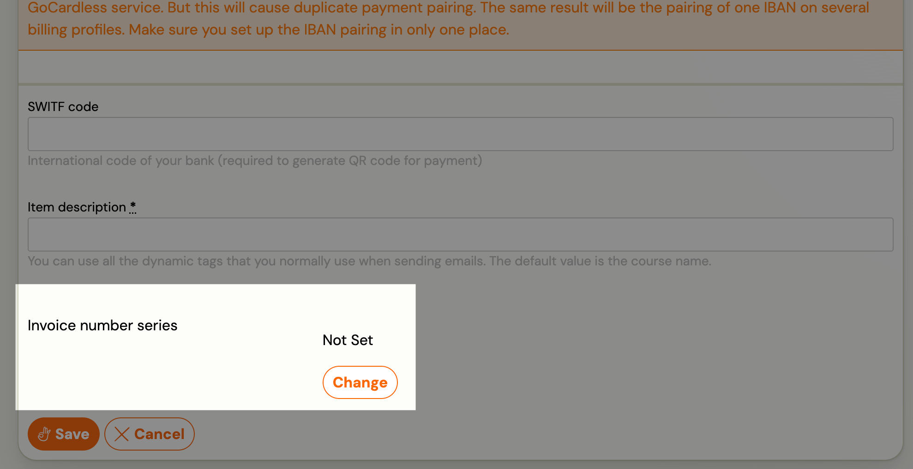

# SmartBill Integration

SmartBill is a Romanian cloud invoicing platform. When connected, Zooza creates invoices directly in your SmartBill account.

**Market:** Romania
**Setup effort:** Email + API token + CIF (Romanian tax ID)

---

## Before you start

You need an active [SmartBill](https://www.smartbill.ro/) account. The **CIF** (Romanian fiscal identification number) you enter in Zooza must match your SmartBill account exactly.

---

## Setup

1. Go to **Settings → Billing** and open your Invoice Profile.
2. In the **Invoice Engine** section, select **SmartBill**.
3. Enter your credentials:

   | Field | Where to find it |
   |---|---|
   | `Email` | Your SmartBill account email |
   | `API Token` | SmartBill → My Account → Integrations → API |
   | `CIF` | Your Romanian tax identification number |
   | `Invoice Series` | Optional — controls invoice numbering; set in SmartBill |

   

4. Click **Save**.

   

---

## How invoices work

Once connected:

- Every time a payment is recorded in Zooza, an invoice is created in your SmartBill account.
- SmartBill assigns the invoice number and controls numbering via the invoice series.
- PDF is available for download after creation.
- VAT settings are pulled from SmartBill into Zooza.
- Changes made in SmartBill are not synced back to Zooza.

### VAT setup

After connecting, sync VAT rates from SmartBill:

1. Go to **Settings → Billing** → scroll to **VAT levels**.
2. Click **Synchronize** to pull VAT rates from SmartBill.

   

### Invoice series

Set the invoice number series in SmartBill, then select it in the Invoice Profile in Zooza:

---

## What works and what doesn't

| Feature | Status |
|---|---|
| Invoice creation | ✓ Automatic |
| PDF generation | ✓ Available after creation |
| VAT sync from SmartBill | ✓ Supported |
| Invoice numbering | ✓ Managed by SmartBill via series |
| Payment sync | ✗ Not supported — payments tracked in Zooza only |
| Credit notes | ✗ Not supported — issue in SmartBill directly |
| Editing invoices after creation | ✗ Edit in SmartBill — changes don't sync back |

---

## Known issues

**CIF mismatch** — The CIF entered in Zooza must match your SmartBill account exactly. A mismatch will cause invoice creation to fail.

**Invoice count limit** — The number of invoices you can issue depends on your SmartBill subscription plan.

---

## Related

- [Invoicing overview](./invoicing-overview.md) — how invoice engines work
- [Billing and invoicing](./billing-and-invoicing.md) — Invoice Profiles, auto/manual generation, multi-line
- [VAT management](../guides/vat-management.md) — configuring VAT rates
