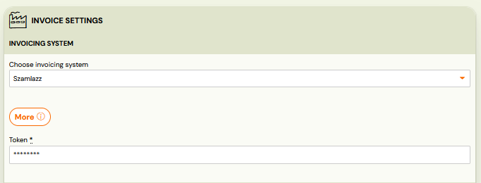
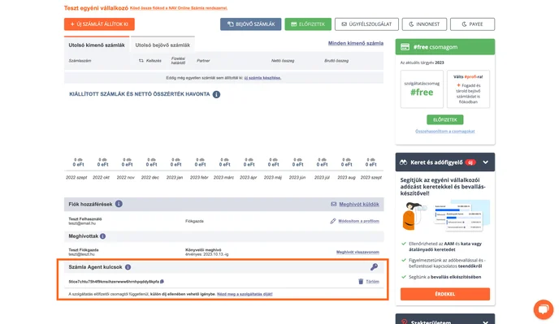
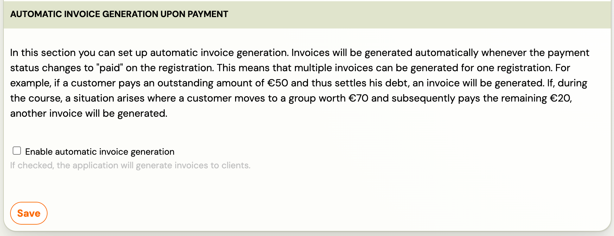
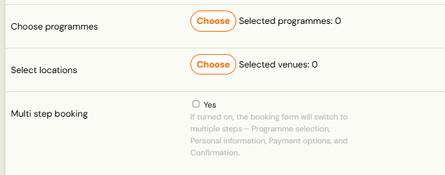

# Szamlazz Invoice Management

Integration to the Számlázz invoice management system used in Hungary.

[https://www.szamlazz.hu/szamla/main](https://www.szamlazz.hu/szamla/main)

Info: Connection to this service allows you to create and maintain invoices in the direction of Zooza - Számlázz.

## Functioning of the invoice management process and billing profiles when connected:

Notes:

1. The invoice numbering series is defined within Számlázz.
2. VAT configurations are pulled from Zooza into Számlázz.
3. Once an invoice has been created, it cannot be modified.
4. When linking Zooza and Számlázz, we recommend to use a Számlázz test environment. After confirming that everything works as expected, switch to your live Számlázz account.
5. For business registrations, Számlázz will automatically forward each generated invoice to Hungary’s NAV system.

## Connection in Zooza:

1. In Zooza, select Számlázz in the Billing System and paste the token you find in Számlázz
 
2. Token can be found on the main page at the bottom under invoice list and the block of users. Detailed information can be found in this [link](https://tudastar.szamlazz.hu/gyik/kulcs).
 
 Resource: [https://tudastar.szamlazz.hu/gyik/kulcs](https://tudastar.szamlazz.hu/gyik/kulcs)
3. Choose whether you want automatic generation of invoices or you will manually generate invoices per registration.
 
4. Set up Billing profile/s for communication from Zooza.
5. Set up VAT
 
6. Set the number series for invoicing in Számlázz

Tip: For automatic invoice generation link your billing profile to the GoCardless app for automatic payment pairing - [Invoicing.](https://support.zooza.online/portal/en/kb/articles/invoicing)

Info: If you need to connect multiple Számlázz accounts to a single Zooza account, you can do this by linking each Számlázz account to a separate invoice profile. This way, you can create multiple invoice profiles in Zooza, with each one connected to its own Számlázz account. To set this up, simply add the token in the invoice profile settings, at the bottom of the page.

