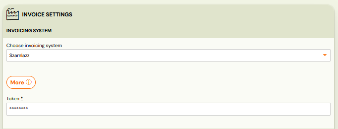
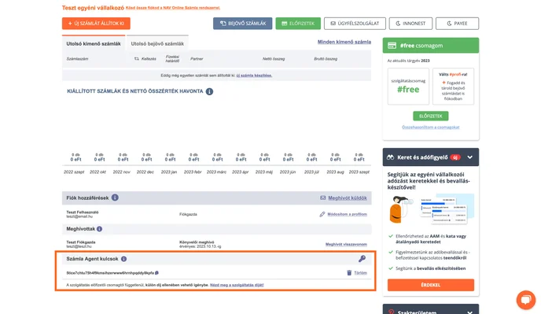
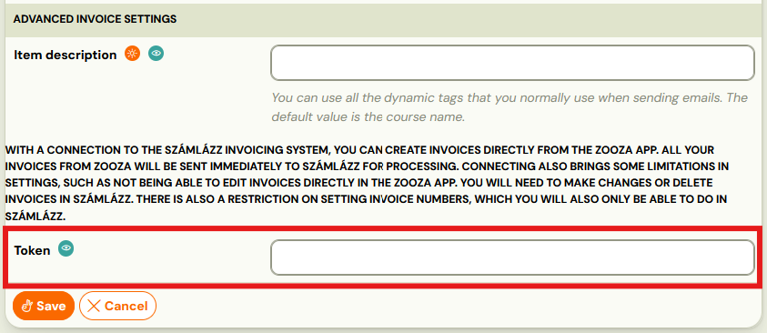
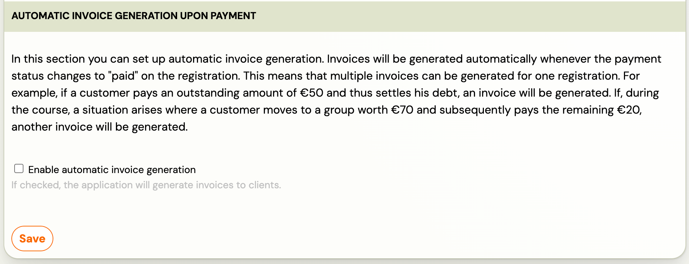
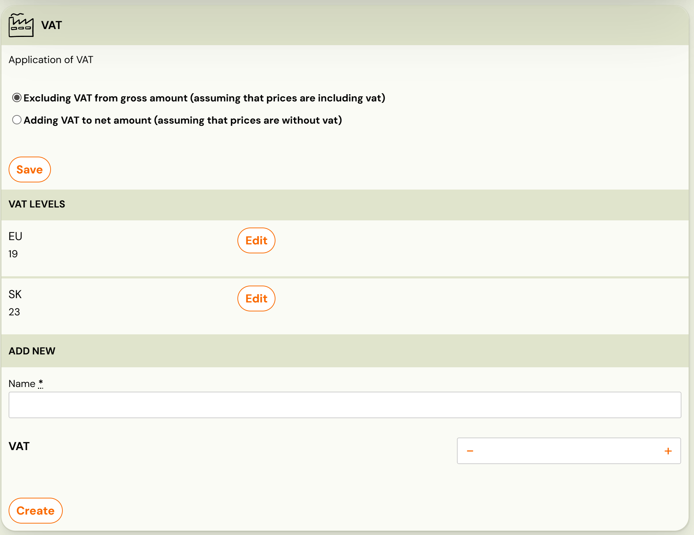

# Számlázz.hu Integration

Számlázz.hu is a major Hungarian cloud invoicing platform. When connected, Zooza creates legally compliant Hungarian invoices directly in your Számlázz.hu account. For business bookings, invoices are automatically forwarded to Hungary's NAV tax system.

**Market:** Hungary
**Setup effort:** Paste API token

---

## Before you start

You need an active [Számlázz.hu](https://www.szamlazz.hu/) account. Számlázz.hu has a test environment — use it to confirm the integration works before going live.

---

## Setup

1. Go to **Settings → Billing** and open your Invoice Profile.
2. In the **Invoice Engine** section, select **Számlázz.hu**.
3. Paste your **API token**:
   - Find it in Számlázz.hu on the main page, at the bottom — below the invoice list and the users block.
   - Detailed instructions: [Számlázz.hu API key guide](https://tudastar.szamlazz.hu/gyik/kulcs)

   

   

4. Click **Save**.

> **Tip:** You can connect multiple Számlázz.hu accounts to one Zooza account by adding a different API token to each Invoice Profile. Each profile links to its own Számlázz.hu account.

---

## How invoices work

Once connected:

- Every time a payment is recorded in Zooza, an invoice is created in Számlázz.hu.
- Invoice numbering is managed by Számlázz.hu via the number series configured there.
- For business bookings (B2B), invoices are automatically forwarded to Hungary's **NAV** tax system — no manual steps required.
- If a customer has already paid (pre-paid), the payment is automatically recorded on the invoice in Számlázz.hu — the invoice appears as paid immediately.
- Invoices cannot be modified after creation.

### VAT setup

After connecting, configure VAT in Zooza:

1. Go to **Settings → Billing** → scroll to **VAT levels**.
2. Select how VAT should be applied and click **Synchronize**.

   

   

---

## What works and what doesn't

| Feature | Status |
|---|---|
| Invoice creation | ✓ Automatic |
| NAV submission (B2B) | ✓ Automatic for business bookings |
| Pre-paid invoice marking | ✓ Automatic — payment recorded immediately |
| Multiple Számlázz accounts | ✓ Via separate Invoice Profiles |
| Payment sync | ✓ Partial — pre-paid invoices only |
| Credit notes | ✗ Not supported — issue in Számlázz.hu directly |
| Editing invoices after creation | ✗ Not possible once created |

---

## Known issues

**Invoice cannot be modified** — Once created in Számlázz.hu, invoices cannot be changed. Plan carefully before generating.

**Test first** — Számlázz.hu has a test environment. Use it to verify the integration before switching to your live account.

---

## Related

- [Invoicing overview](./invoicing-overview.md) — how invoice engines work
- [Billing and invoicing](./billing-and-invoicing.md) — Invoice Profiles, auto/manual generation, multi-line
- [VAT management](../guides/vat-management.md) — configuring VAT rates
