# Trial sessions

Trial sessions are a great way to show what your programmes have to offer. You will allow clients to get a better understanding of the content and teaching style without having to commit right away. You are helping them let go of concerns about whether a programme is right for them or their child. Trial sessions are available only for programme type Booking for full duration. Trial is set in the programme settings in the Trial tile. Get started by clicking *Edit.*

This approach is ideal not only for attracting new clients, but also for launching new locations or introducing new types of programmes. Trial sessions are the first step to building trust and success.

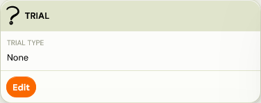

## Step-by-step trial session settings

## Trial type

The first step is to choose the trial type. The following options are available:

1. Free Trial (Single Session/ Multiple Sessions)
2. Paid Trial (Single Session/ Multiple Sessions)
3. Lead collection

### Free Trial

Select Free Trial if you want to let clients attend sessions without any payment obligation. No debt is created for these bookings.

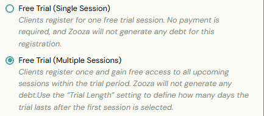

### Paid Trial

A Paid Trial allows you to charge clients a smaller, introductory fee for attending one or more sessions before they commit to the full programme. This is useful when you want to increase commitment compared to a free trial, while still lowering the entry barrier.

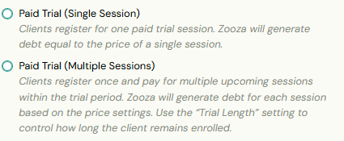

You can set a special unit price specifically for the trial.

1. If you leave the trial price at 0, Zooza will automatically apply the default unit price from the programme or class.
2. If you enter a value greater than 0, this will be the price clients pay per trial session instead of the regular programme price.

This flexibility allows you to, for example, offer a trial session at half the standard price or set a flat introductory fee.

### Lead collection

With Lead Collection, clients can sign up for a trial session, but the exact date is assigned by you. This works similarly to the Lead Collection class feature, where the administrator later assigns clients to specific classes with set dates.

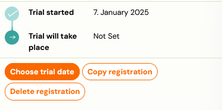

## Trial Length

Trials can be offered as either:

### Single Session

Available for both free and paid trials. Clients can register for one trial session only. After this session, the standard post-trial process begins.

### Multiple Session

Clients can register for several trial sessions with a single click (free or paid). You decide how many sessions are included by setting the Trial Length Method:

1. Days – the number of days during which the client is automatically enrolled in all available sessions.
2. Sessions – the number of sessions the client is automatically enrolled in, if capacity allows.

To finalize the setup, enter the number of days or sessions in the* Trial Length* field.

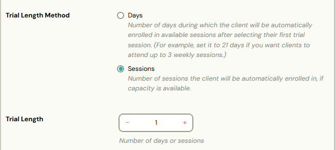

## Sessions shown in Form

This setting is available when you enable a free or paid trial. It determines how many upcoming sessions clients can see and choose from when signing up for a trial.

You can limit the sessions in three ways:

1. None - If no limit is set, clients will see* all upcoming sessions with available capacity *in the registration form and can select any available date for their trial.
2. By number of days - Trial sessions are limited by a time window. Clients will only see sessions that fall within the number of days you specify.
3. By number of sessions - If you want to restrict the number of sessions shown, regardless of date, set a session limit. The registration form will then display only the specified number of upcoming sessions.
 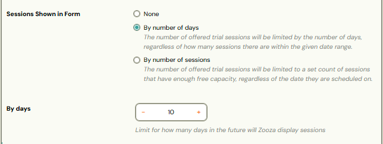

Example: A class runs from January 6 to March 30 with sessions every Monday and Wednesday. If the limit is set to 10 days and a client registers on January 12, the registration form will display trial sessions between January 13 and January 22 (inclusive).

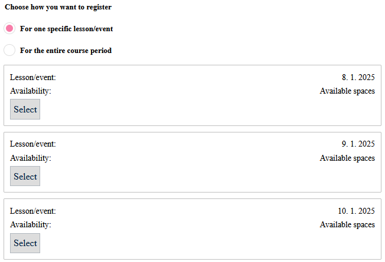

## Session Capacity

When setting up trial sessions, you can decide how session capacity is handled. Two options are available:

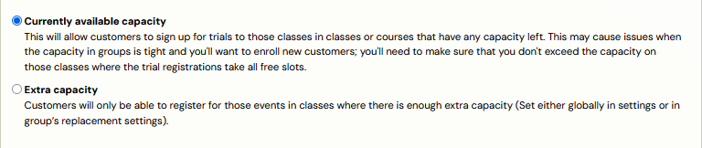

### Current available capacity

If you select Current Available Capacity, clients can only register for a trial session if there is space left in the class. Zooza will combine both the main class capacity and any extra capacity to determine availability for trial sessions.

Example: Class capacity is 10. Global extra capacity of 1 and class extra capacity of 1 are added to this, giving a total capacity of 12. If 2 clients sign out of the class capacity, there will be 4 vacancies for trial classes - 2 from the extra capacity and 2 released from the class capacity.

### Extra capacity

If you select Extra Capacity, trial participants can only be booked into the extra capacity, not into the main class capacity. This ensures that regular enrollments always take priority. In this case, even if someone cancels from the main class capacity, those slots remain reserved for regular enrollments and are not offered to trial participants.

Example: Class capacity is 10. To this is added a global extra capacity of 1 and a class extra capacity of 1, making a total of 2 extra capacity. Only these 2 places are available for trial sessions, and the class capacity remains intact even if someone cancels out of the session.

Tip: The use of additional capacity for trial sessions helps to maintain the capacity reserved for properly enrolled participants. The extra capacity reserved for trial sessions allows for a clear separation of places, making it easier to manage and organise sessions.

## Classes included in trial

If you want newly created classes to be automatically included in your trial, select *Yes*.The final step is to choose the classes where you plan to offer trial sessions. Click *Edit *to view a list of active classes within the relevant billing periods and make your selection.

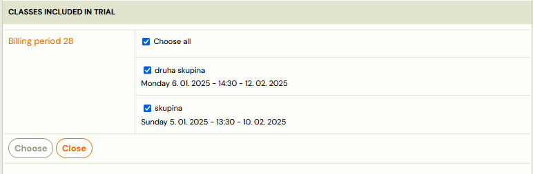

Note:
 If you selected Interest classes in the previous step when selecting the Trial Type, you need to have previously created classes of the Interest type for which you want to activate the Trial Session feature.

Tip! You can enable trial sessions at the class level in the *Settings *tile under *Class Properties *by selecting the check box. However, if the trial sessions feature is not enabled for the programme, this setting will be ignored and a message will be displayed.

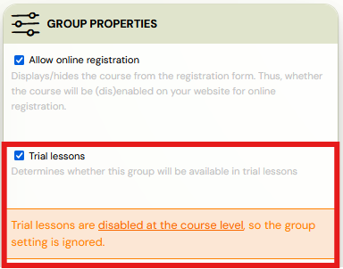

## What a trial session in Zooza looks like

## In the booking detail

The moment a client signs up for a trial session via the registration form, the booking detail will show the status Trial started. Below it, a list of the steps that will follow is displayed:

1. The date the trial booking was created
2. The date on which the trial session will take place
3. Dates related to sending notifications to register for the programme

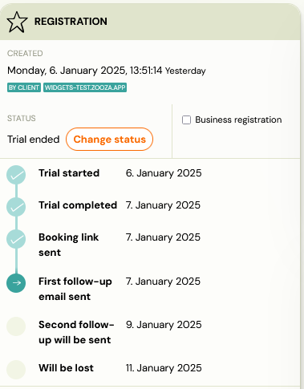

Alert! If you do not have notification automation enabled, information about when notifications are sent will not be displayed. You will only see the actions resulting from the current trial sessions settings on the programme.

Warning! Trial sessions have different statuses than standard programme bookings:

1. *Trial started *- Valid from the date of booking to the time of the actual session.
2. *Trial ended* - If automatic notifications are set up, a notification with a URL to the pre-populated programme registration form will automatically be sent to the client when the session is completed.
3. *Trial won* - Occurs after the client has successfully registered for the programme.
4. *Trial lost *- Occurs in following cases:
5. Attendance form for the term is not filled out and the session has already occurred.
6. The client does not respond to automatic notifications about the opportunity to enroll in the programme after completing the trial session.

## On the session/session

The information about who is coming for the trial session will be displayed directly on the attendance details of the session.

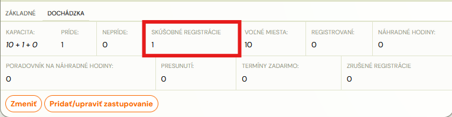

## In the client´s profile

When a client signs up for a trial session, they can view it in their profile under Programme Interest, where they will find all the relevant details, just like a regular programme sign-up. If the date does not suit him, he has the option to cancel within the limit set for the replacement sessions. If the programme allows for replacement sessions, the client will be entitled to use them according to the rules set for the programme.

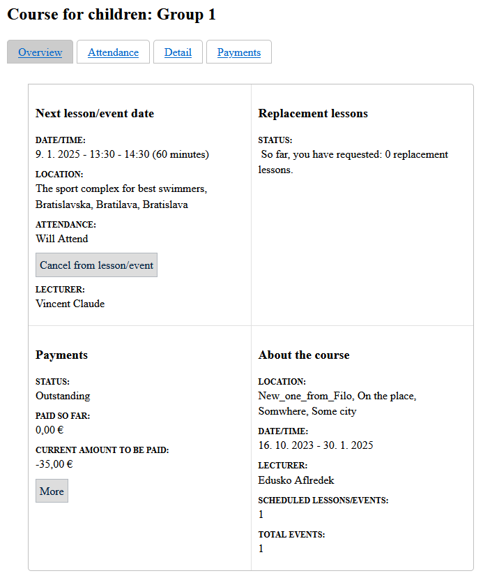

## Automation settings

For the Trial Session booking type, email notifications are prepared to prompt the client after completing the trial session if he/she wants to enroll in the full programme. You can set what will be sent to the client and when after the trial session. The following notifications are available:

1. Information about the possibility to register for the full programme with a link to the pre-populated registration form.
2. 2 reminders after the number of days you set, if the client has not yet registered.
3. Change of status to Trial lost if the client does not respond to the sent link, with an option to inform them of this change.
4. You can review and edit all notifications in the Communication section under Message Templates. You can read instructions on how to do this [here](../guides/message-templates.md).

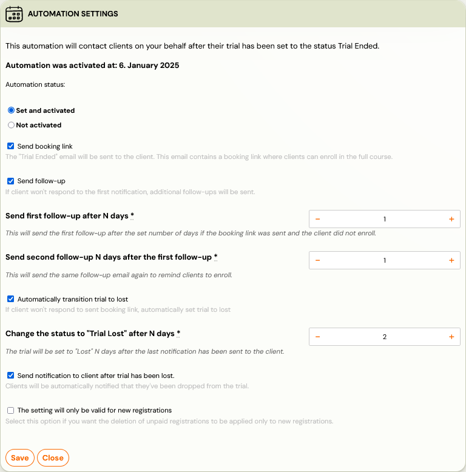

## Registering for the programme after completing the trial session

After completing the trial session and deciding to continue with the programme, the client has two options:

1. client can register himself after receiving an automatic notification
2. or you can help them to register directly through the system

## Client booking

Immediately after completing the session (if attendance is recorded), the client will receive a notification informing them of the opportunity to enroll in the programme. Clicking on the attached link will open a pre-populated registration form, in which the client can conveniently register.

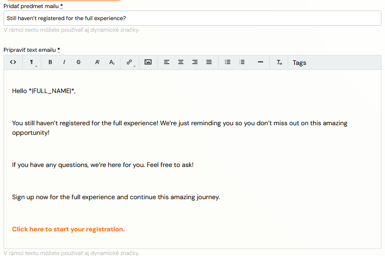

## Login by the administrator

If you and your client have agreed that you will register them, you can easily do this through the application.

1. In the trial booking details, click on *Enroll.
 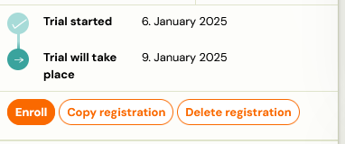
 *
2. A window will appear with information about the class you can register the client to.
 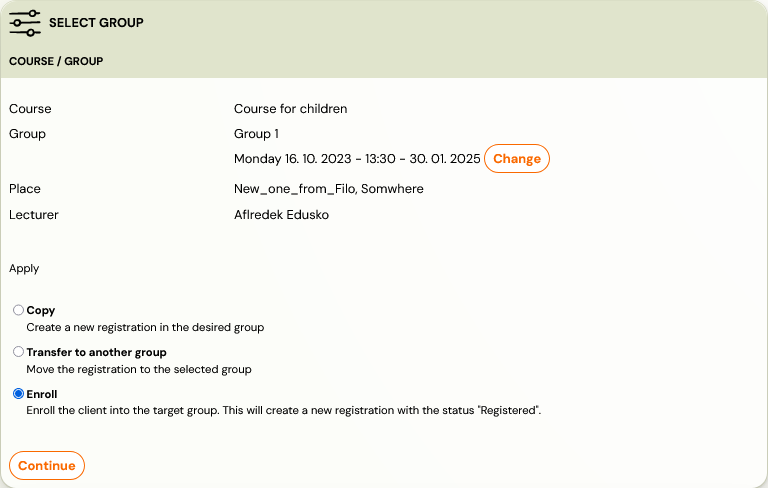
3. After selecting the class, set the amount you expect to pay for booking and click Continue. If you have payment templates set up on the class, the application will automatically offer them to you and take you to the payment plan settings.
 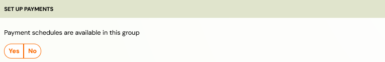
 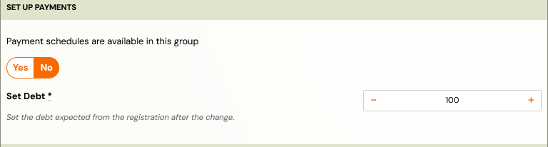
4. Check the details you have entered and confirm your booking by clicking Continue.*
 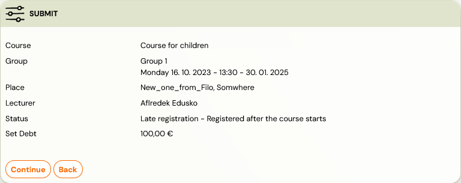
 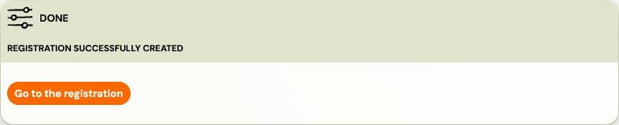
 *
5. Once you have successfully registered for the programme, the status of the trial will change to Trial won.
 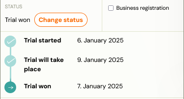

Warning! After enrolling in the programme, the client will receive a new variable symbol. However, for better clarity, the trial and regular booking remain linked, allowing you to easily check them.

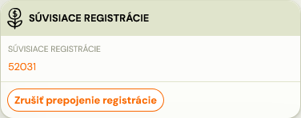
