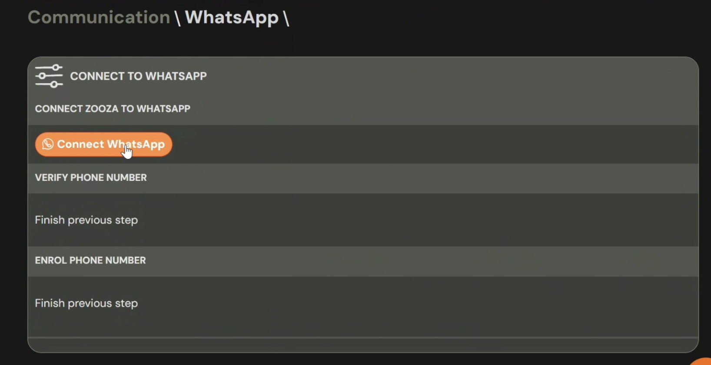
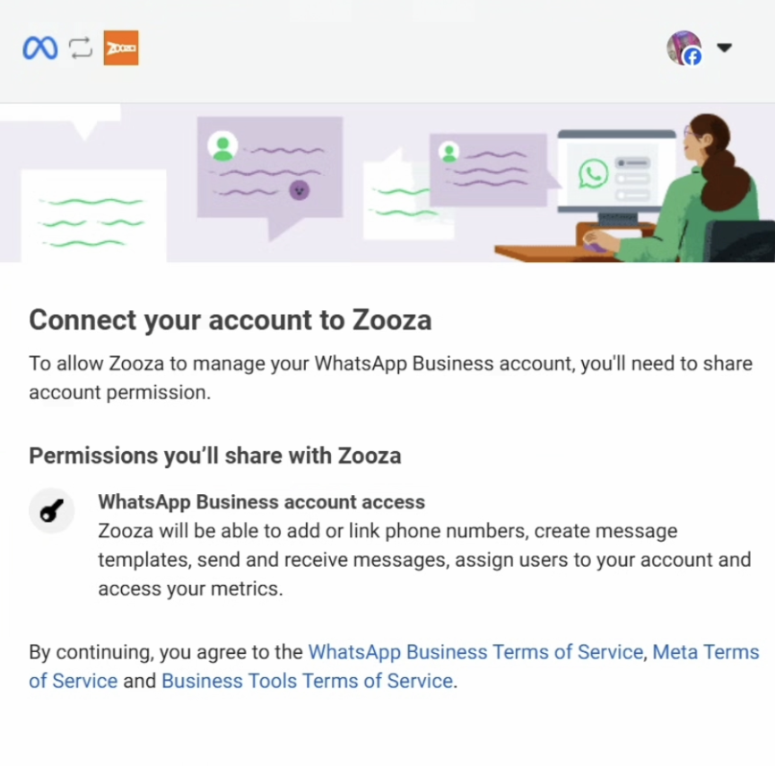
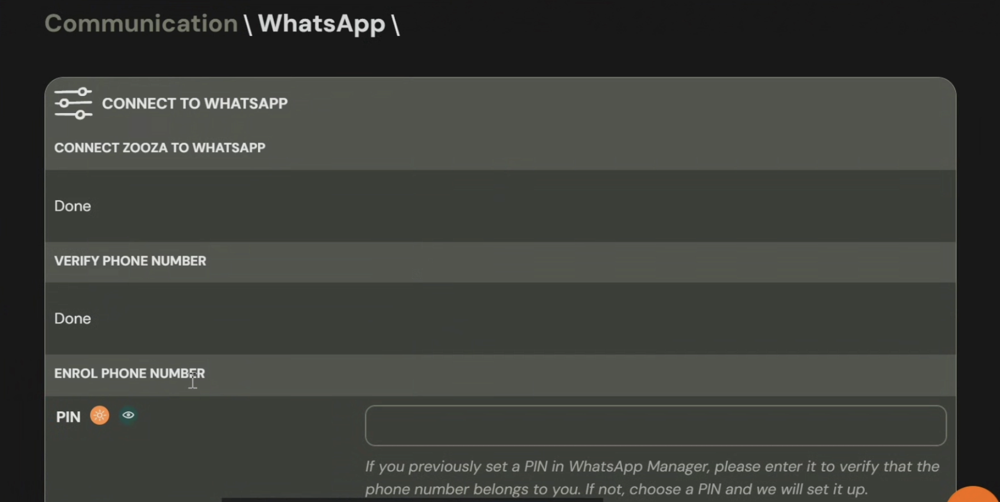

# WhatsApp Integration & Usage (Beta)

> **Status:** This feature is in **beta** and improving continuously.

> **Availability:** If you do not see **Connect to WhatsApp** in Zooza, either (a) your plan does not include the integration or (b) WhatsApp Business Platform is not enabled for your account. In both cases, **contact us** and we will help.

## What you will need

- A **Facebook (Meta) Business Account** with admin rights.
- A **phone number** to dedicate to WhatsApp **Business Platform** (API).

> A number connected to the API **cannot** be used in the standard WhatsApp or WhatsApp Business mobile app at the same time. Many brands keep two numbers: one for **Zooza automation & threads**, one for **manual mobile chats**.

## Connect WhatsApp to Zooza (step-by-step)

1. **Open WhatsApp settings in Zooza**
   Go to **Communication --> WhatsApp**.

2. **Click "Connect to WhatsApp"**
   This starts Meta's guided connection flow in a new window.

3. **Complete Meta's connection flow**
   Make sure you are logged into Facebook as a **Business Admin** who can manage the Business Account. Then follow the prompts:
   - **Continue as _you_** --> **Connect as _you_**
   - **Select Business**: choose the correct **Business Account** and (if asked) the Page/portfolio you will use.
   - **Business details**: choose the **business name** and **country** for the franchise/company.
   - **WhatsApp profile**: set the **display name** (or select an existing WhatsApp profile/number).
     > If using an **existing number**, it must be **disconnected** from all other apps (including the WhatsApp Business mobile app). One number = one platform.
   - **Choose category** (e.g., **Education**).
   - **Add new phone number** (if needed) and complete **verification** (SMS/voice code).
   - **Confirm** and wait -- connection can take a few minutes. **Do not close** the window.

4. **Return to Zooza**
   Go back to **Communication --> WhatsApp** and **refresh**. You should see **Status: Done**.

5. **Create your PIN**
   Set a **6-digit PIN** and **save it**. Meta may request this PIN later for security actions in Business Manager.

6. **Verify status**
   Confirm that Zooza shows your connected number and status as active.

## Verify your business with Meta

Business verification unlocks **more templates** and **higher free message volumes**.

Do this in Facebook Business Manager:
`https://business.facebook.com/latest/settings/business_info`

## Add payment method and Meta pricing requirements

To send outbound system messages (templates) from Zooza, Meta requires a valid payment method added to your WhatsApp Business Account. Receiving incoming messages and replying within the 24-hour service window is free, but any proactive or system-triggered outbound message (e.g., reminders, confirmations, changes) is billed by Meta according to its conversation pricing.

**What this means for your setup:**

- You must add a credit card in Meta Business Manager under **WhatsApp --> Billing**.
- Without a payment method, Zooza cannot deliver system messages, even if templates are approved.
- **Incoming messages**: free. You can reply to any parent message within the 24-hour window at no charge.
- **Outbound system messages**: billed by Meta based on conversation type and region.
- Full pricing overview: `https://business.whatsapp.com/products/platform-pricing`

Once your card is added and Meta billing is active, Zooza can automatically send templates for login, confirmations, reminders, schedule changes, and other system sessions.

## How WhatsApp works in Zooza

### Conversations

- When a parent messages your connected number, the conversation appears in **Zooza App --> Messages --> WhatsApp --> Conversations**.
- A parent message opens a **24-hour window** where your team can reply freely from within Zooza.
- Each reply from either side **extends** the window by another 24 hours.

### Templates

- After business verification, Zooza submits a set of **official WhatsApp templates** (e.g., login, confirmations, reminders, changes, payments) for **Meta approval**.
- Once approved, Zooza **automatically** uses them for system sessions.
- You can edit wording and languages; newly edited templates must be **re-approved**.
- Manage in **Zooza App --> Messages --> WhatsApp --> Templates**.

### Broadcasts / Mass messaging (in development)

- Sending approved templates to a larger audience (e.g., term announcements) is possible but **under construction** in the UI.
- Treat broadcasts as **marketing**; follow Meta rules and local regulations.

## Compliance & best-practice tips

- **Use helpful, expected messages.** Time-sensitive updates (reminders, changes, login codes) work best on WhatsApp. Longer documents and policy info are often better via **email**. Zooza can **send both**.
- **Respect the 24-hour window.** Outside the window, you must use an **approved template** to re-engage.
- **Do not spam.** Keep broadcasts relevant and spaced. Consider opt-in where required by local law.
- **Choose your number strategy.**
  - API number (Zooza) = automation, logging, permissions, audit trail.
  - Optional second number = ad-hoc mobile chats (if your ops require it).
- **Brand & privacy.** Messages link back to your **website/Parent Portal**. Zooza keeps a log for auditing and GDPR purposes.
- **Pricing & limits.** Zooza charges for the **integration feature**, not per message. Meta grants **free volumes** up to certain tiers; higher tiers follow Meta policy.

## Summary

1. **Communication --> WhatsApp --> Connect**
2. Finish Meta flow (admin rights, business, number, verify code)
3. Back to Zooza, **refresh**, status **Done**
4. Set and **remember your PIN**
5. **Verify business** in Facebook for higher limits
6. Use **Conversations** and **Templates** in Zooza to operate WhatsApp at scale

If you need help at any step, contact us -- our team can check your setup and guide you through Business Verification.

**See also:** [WhatsApp Troubleshooting](../troubleshooting/whatsapp-troubleshooting.md) | [WhatsApp FAQ](../faq/whatsapp-faq.md)
