# Xero Integration in Zooza: Setup & Invoice Management

Setup & Invoice Management Guide

This guide explains how to connect Xero with Zooza, how to configure VAT, accounts, and billing profiles, and how invoices behave in different scenarios (VAT payer / non-VAT payer, manual vs automatic invoices).

The goal of this integration is simple:

Invoices created in Zooza are automatically created and marked as paid in Xero when a payment is recorded.

## 1. Connecting Xero to Zooza

To connect Xero:

1. Go to Zooza → Settings → Billing "Invoice Settings" and choose Xero. → Click Connect Xero

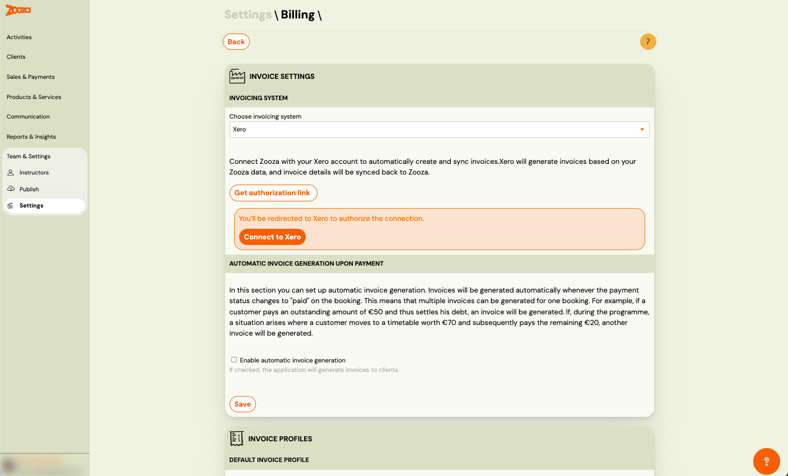

2. Log in to your Xero account and Allow Access

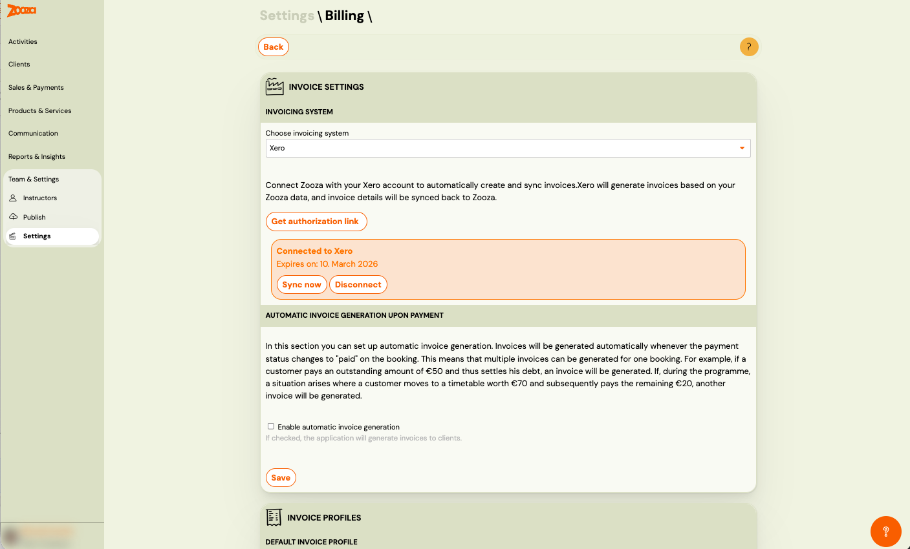

Once connected, you can:

- Sync data at any time using Sync
- Zooza will pull tax rates, bank accounts, and revenue accounts from Xero

✅ No additional setup is required at this stage.

## 2. VAT Sync (Only if You Are a VAT Payer)

If you are a VAT payer:

1. Go to Zooza → Settings → Billing (to bottom of the page)
2. Click Sync VAT
3. Zooza will load VAT / tax rates from Xero

If you are not a VAT payer, you can skip this step entirely.

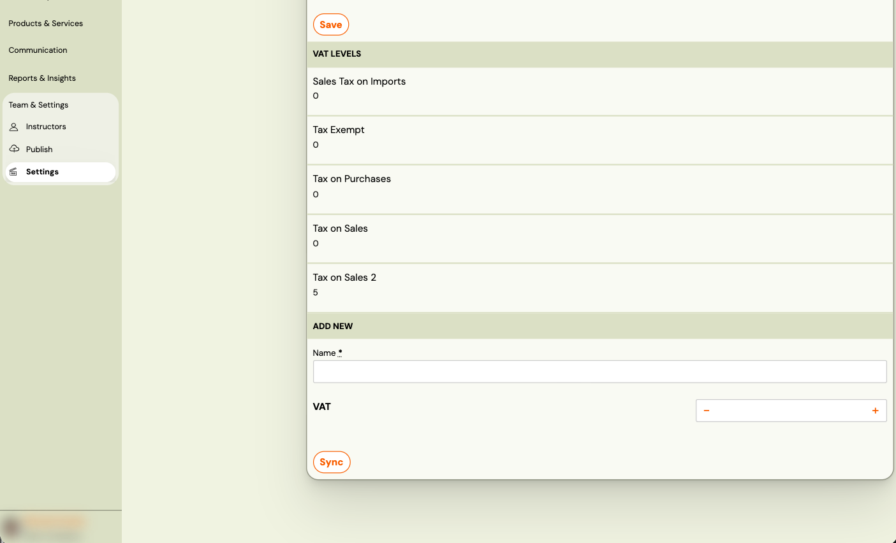

## 3. Tax Setup in Xero (Important)

In Xero, you must have a tax rate correctly assigned to your revenue accounts.

Best practice:

- Assign the tax rate to a revenue account, e.g. 200 – Sales (or your preferred sales account)

If:

- A new tax rate is created in Xero → Simply return to Zooza and click Sync at the bottom of the Billing page. (Zooza → Settings → Billing (to bottom of the page))

## 4. Invoice Profile – VAT Settings

Go to Zooza → Billing → Invoice Profiles (Click on the Not Set or name of the invoice profile to go to the detail)

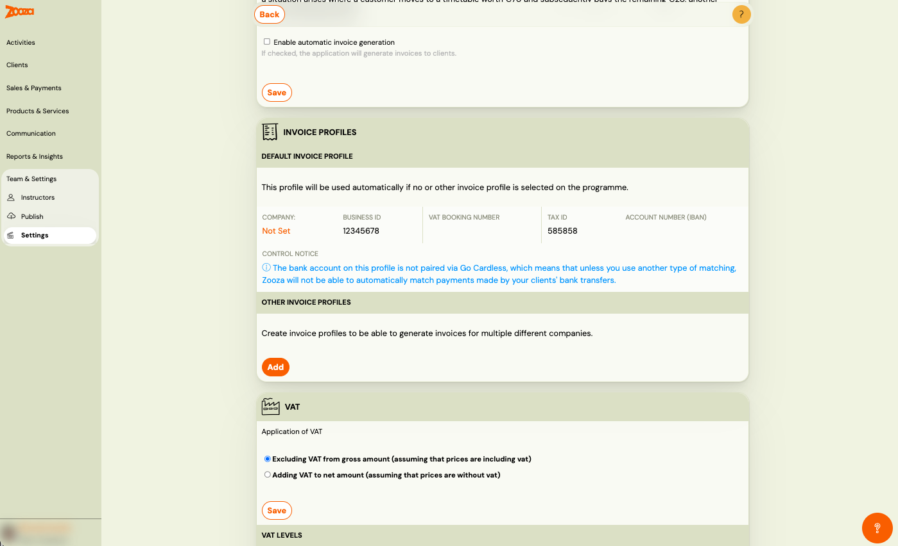

### If you ARE a VAT payer:

1. Enable Tax payer
2. Select the tax rate (synced from Xero)

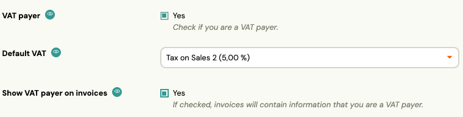

### If you are NOT a VAT payer:

- Leave Tax payer unchecked
- No tax rate is required

## 5. Bank Account Setup (Very Important)

At the bottom of the Invoice Profile:

Select a Bank Account (synced from Xero)

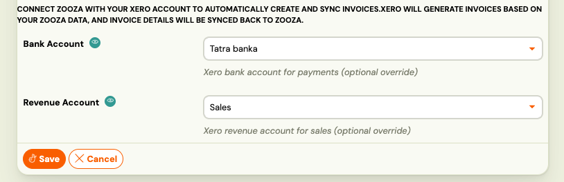

### Important rules:

- The bank account must exist in Xero
- It must be created as a Bank Account
- It must have a code (any code is fine)

If the bank account:

- Is created later in Xero → refresh Zooza

Invoices cannot be edited in Zooza after creation.Changes made in Xero are not synchronised back to Zooza.Paid invoices in Xero have very limited edit options due to accounting and VAT rules.

If no bank account is selected:

- The invoice will be created in Xero
- But it will NOT be automatically marked as paid in Xero

Next, select a Revenue Account from Xero.

This account:

- Represents the income (e.g. Sales)
- Has a tax rate assigned in Xero
- Must match the tax rate selected in the Billing Profile

You can view and manage these accounts directly in Xero:

Xero → Accounting → Chart of Accounts → All Accounts

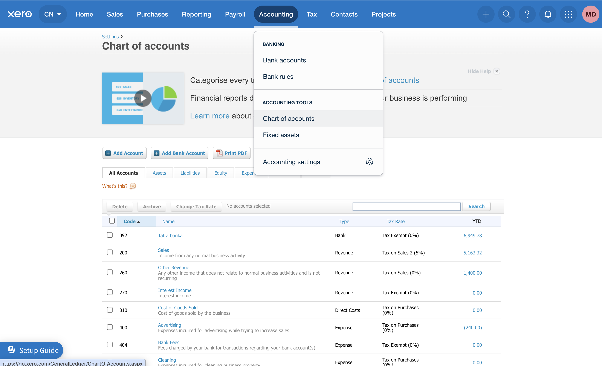

## 6. Save the Billing Profile

Once all settings are complete:

- Click Save

## What This Setup Achieves

With the setup above:

- Every invoice created in Zooza based on a payment
- Is automatically:Created in Xero
- Marked as Paid  → Paid invoices in Xero have very limited edit options due to accounting and VAT rules.
- Linked to the correct bank and revenue account

This works for:

- Online payments
- Manually recorded payments (if invoicing is enabled)

## Manual Invoice Creation (Optional)

You can also create invoices manually.

Where:

- In the Booking detail

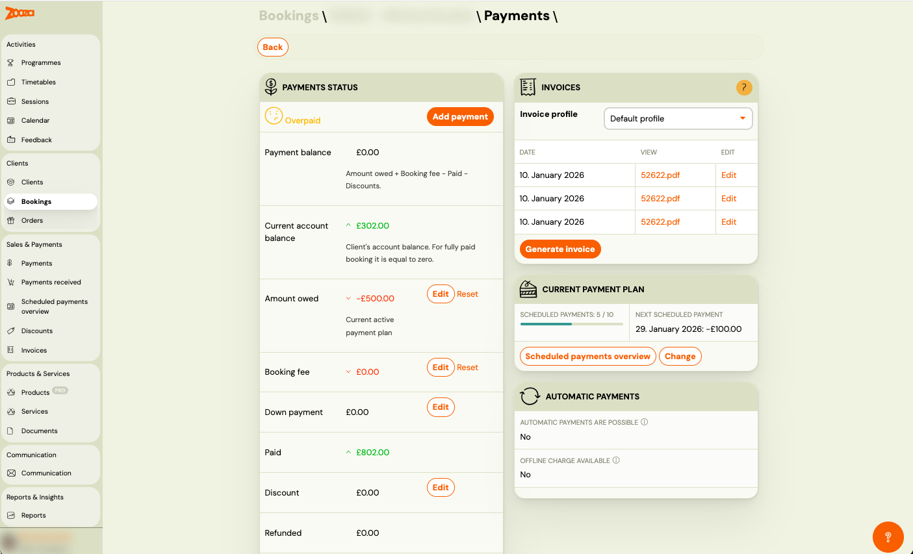

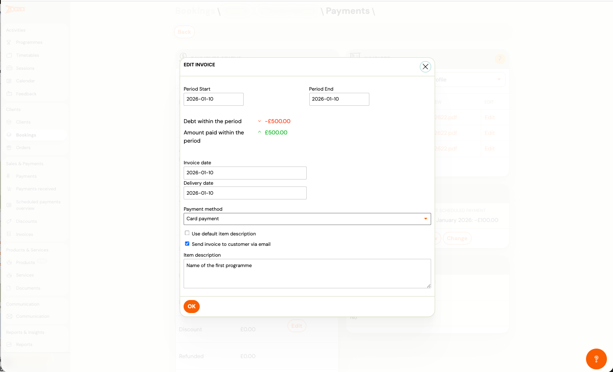

- Or when adding a manual payment

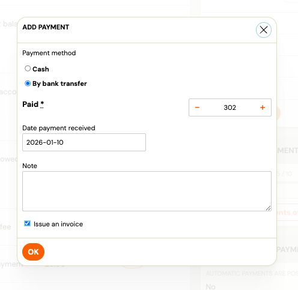

How:

1. Select the period the invoice covers
2. Generate the invoice
3. Optionally send it to the client

This is useful when:

- Payment was received outside Zooza
- Cash or bank transfer was used

## Automatic Invoice Creation (Optional)

You can enable Automatic Invoice Creation
Go to Zooza → Settings → Billing "Automatic invoice generation upon payment"

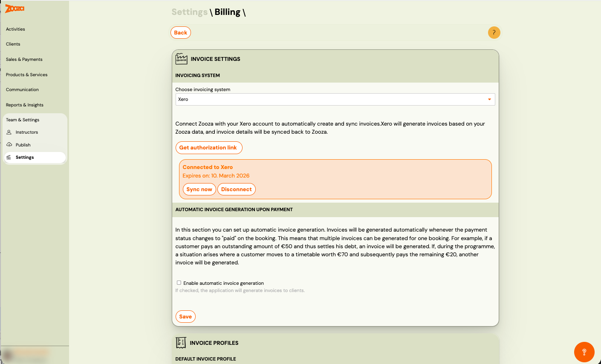

When enabled:

- An invoice is created automatically
- Every time a payment is recorded on a booking

No manual action required.

## Editing Invoices

Important limitation:

- Invoices must be edited in Xero 
- Changes do NOT sync back to Zooza

Zooza always keeps the original reference.

## Where to See Invoices

- Zooza: → Invoices section (overview & links) Zooza → Sales & Payments → Invoices
- Xero: → Full accounting records, payments, reports
