# Xero Integration

Xero is an international cloud accounting platform. The Zooza–Xero integration is the most feature-rich of all invoice engines: invoices are created automatically in Xero, payments are synced back, and account codes can be mapped per transaction type.

**Market:** International (UK, Australia, New Zealand, and others)
**Setup effort:** Connect (OAuth) + configure account codes + re-authorize every 60 days

---

## Before you start

You need an active [Xero](https://www.xero.com/) account with:
- A **bank account** set up in Xero (required for payment sync)
- A **revenue account** with a tax rate assigned (required for invoice line items)

> **Important:** Xero requires re-authorization every 60 days. This is a Xero security policy — not a Zooza limitation. Set a reminder so invoices don't start failing.

---

## Setup

### Step 1 — Connect Xero

1. Go to **Settings → Billing** and open your Invoice Profile.
2. In the **Invoice Engine** section, select **Xero**.
3. Click **Connect Xero** — you are redirected to Xero to log in and authorize Zooza.

   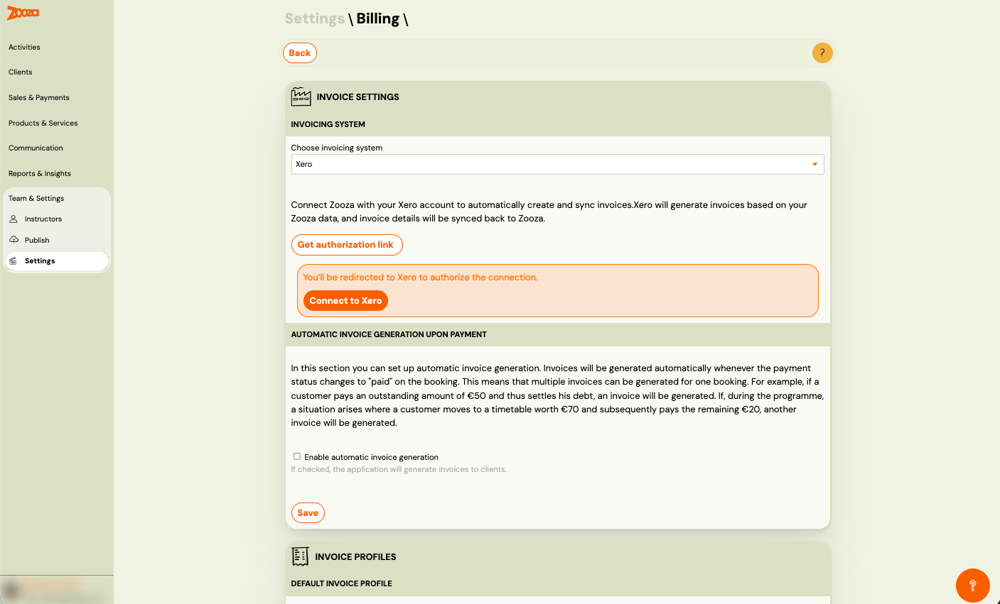

4. Log in to Xero and click **Allow Access**.

   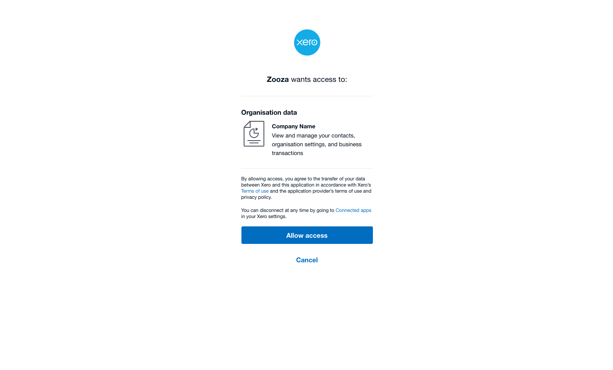

   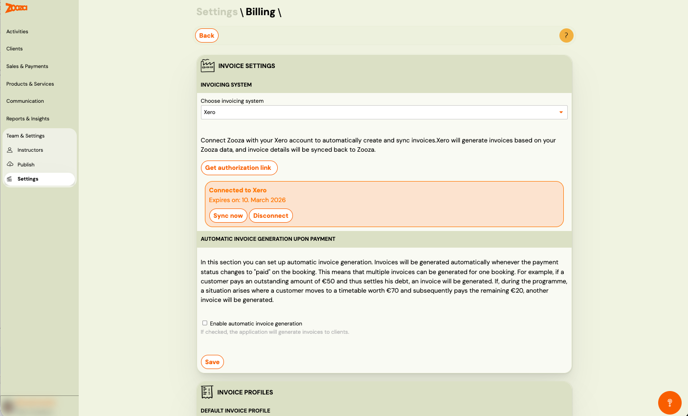

5. You are redirected back to Zooza. The connection is active.

### Step 2 — Sync VAT (VAT payers only)

If your company is a VAT payer:

1. Go to **Settings → Billing** → scroll to the bottom.
2. Click **Sync VAT** — Zooza pulls tax rates from Xero.

   

If you are not a VAT payer, skip this step.

### Step 3 — Configure the Invoice Profile

Open your Invoice Profile (`/#settings/invoice_profiles`) and complete the following:

**VAT settings:**

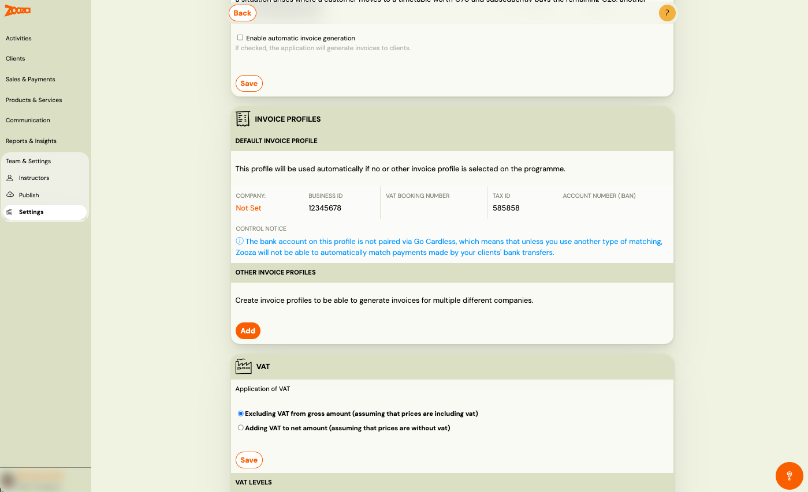

- **VAT payer:** enable and select the tax rate synced from Xero.
- **Not a VAT payer:** leave the VAT payer checkbox unchecked.

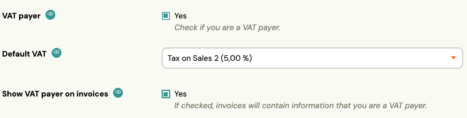

**Bank account:**

Scroll to the bank account section and select the Xero bank account that receives payments.

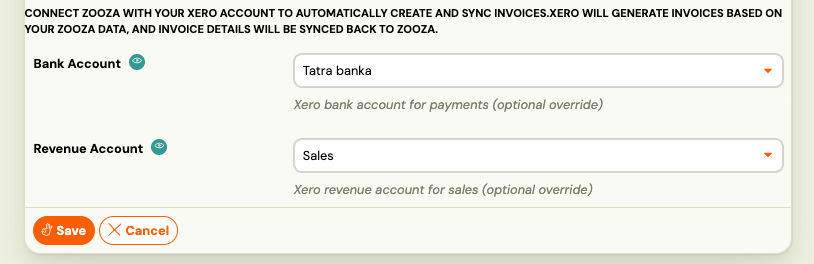

The bank account must:
- Exist in Xero as a **Bank Account** (not just an account in the chart of accounts)
- Have a **code** assigned in Xero

If the bank account was created later in Xero, refresh Zooza to reload the list.

**Revenue account:**

Select the revenue account from Xero. This account:
- Represents your income (e.g. `200 – Sales`)
- Must have a tax rate assigned in Xero that matches the tax rate in this Invoice Profile

Manage revenue accounts in Xero under **Accounting → Chart of Accounts → All Accounts**.

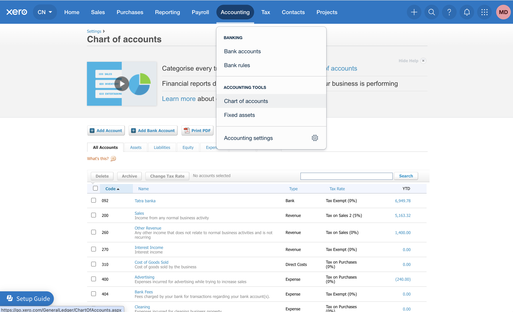

### Step 4 — Save

Click **Save** on the Invoice Profile.

---

## How invoices work

Once configured:

- Every time a payment is recorded in Zooza, an invoice is created in Xero.
- Xero assigns the invoice number.
- After creation, **payment sync runs automatically** — each payment (credit, bank transfer, direct debit, Stripe, refund) appears as a separate transaction in Xero against the invoice.
- Discounts, registration fees, and payment schedules appear as invoice line items — they are not synced as payment transactions.
- The system checks what Xero says is still owed before syncing, to prevent over-payment. Already-synced payments are skipped automatically.

> **Note:** Zooza links to the invoice in Xero but does not store a local PDF copy. To download the PDF, open the invoice in Xero.

---

## Manual invoice creation

You can generate invoices manually from a booking, regardless of whether automatic generation is enabled:

1. Open the booking detail.
2. Find the **Payments** tile and click **Show payments**.
3. Select the invoice period and click **Generate invoice**.

   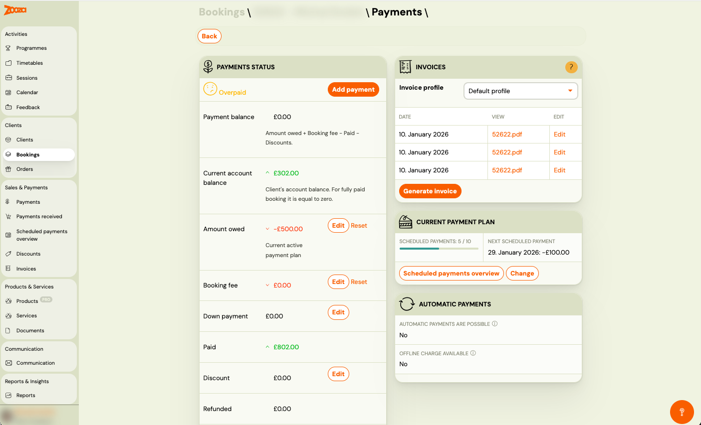

   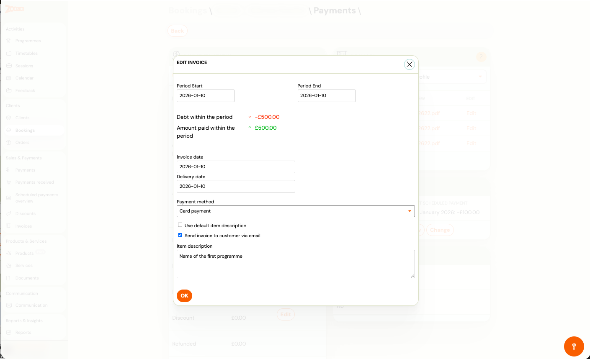

You can also generate an invoice when recording a manual payment:

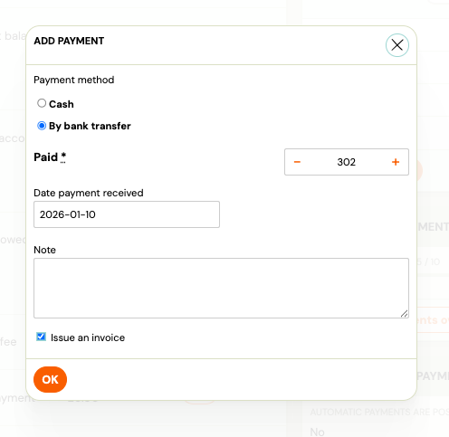

---

## Automatic invoice generation

To enable automatic invoicing on every payment:

Go to **Settings → Billing** → enable **Automatic invoice generation upon payment**.

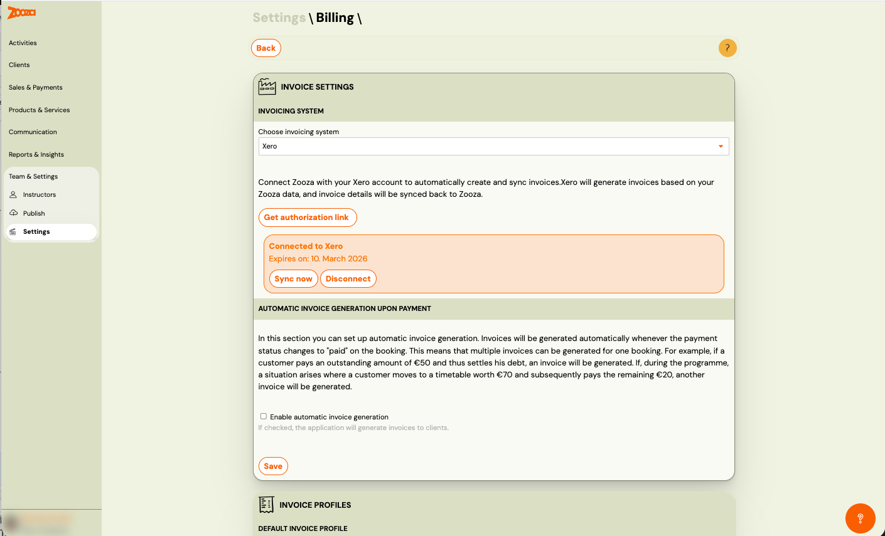

---

## Multi-line invoices and account codes

Xero supports itemised invoice breakdown — each transaction type as a separate line with its own **Revenue Account Code**.

Configure this in the **Invoice Line Types** section of the Invoice Profile. Use **Sync accounts** to pull the latest accounts from Xero, then map each transaction type (Course Payment, Registration Fee, Discount, etc.) to the appropriate Xero revenue account.

See [Billing and invoicing — Multi-line invoices](./billing-and-invoicing.md#multi-line-invoices).

---

## What works and what doesn't

| Feature | Status |
|---|---|
| Invoice creation | ✓ Automatic |
| Payment sync | ✓ Full — each payment as a separate Xero transaction |
| Multi-line invoices + account codes | ✓ Supported |
| VAT sync from Xero | ✓ Supported |
| PDF | Viewable in Xero only — no local copy in Zooza |
| Re-authorization | Required every 60 days (Xero policy) |
| Editing invoices | Edit in Xero — changes sync back to Zooza only after a manual refresh |
| Credit notes | ✗ Not supported — issue in Xero directly |

---

## Known issues

**60-day re-authorization** — Xero forces the connection to expire after 60 days. When this happens, invoice generation fails until you reconnect. Go to the Invoice Profile and click **Connect Xero** again.

**Payments attach to one invoice only** — When a booking generates multiple invoices (e.g. monthly), all payments for the period are synced to the invoice being processed. If a student pays 3 months upfront, the full payment goes on the first invoice — the other two show as unpaid in Xero. **Workaround:** generate one invoice covering the full paid period instead of monthly invoices.

**Tax rate must match** — The tax rate on the revenue account in Xero must match the tax rate configured in the Zooza Invoice Profile. A mismatch causes invoice creation to fail.

---

## Related

- [Invoicing overview](./invoicing-overview.md) — how invoice engines work
- [Billing and invoicing](./billing-and-invoicing.md) — Invoice Profiles, auto/manual generation, multi-line
- [Xero invoicing FAQ](../faq/xero-invoicing-faq.md) — common Xero questions
- [VAT management](../guides/vat-management.md) — configuring VAT rates
