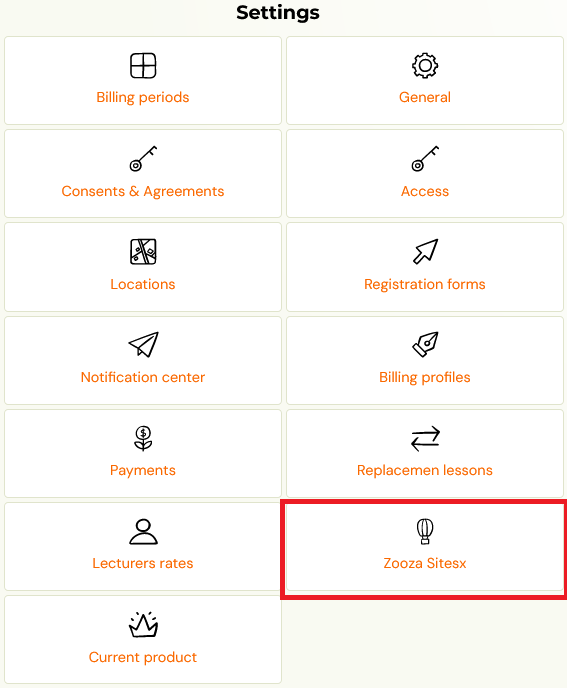
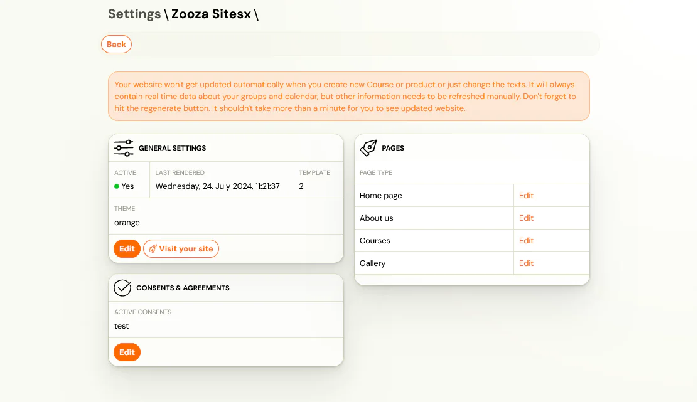
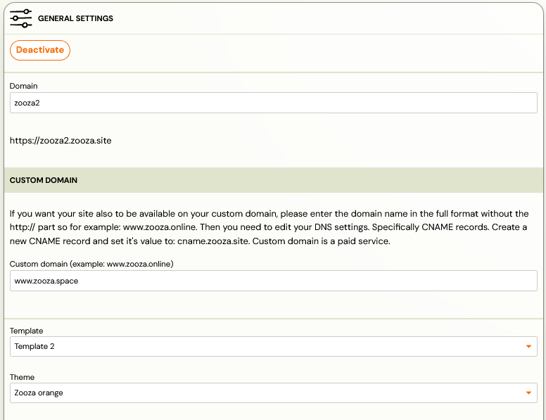
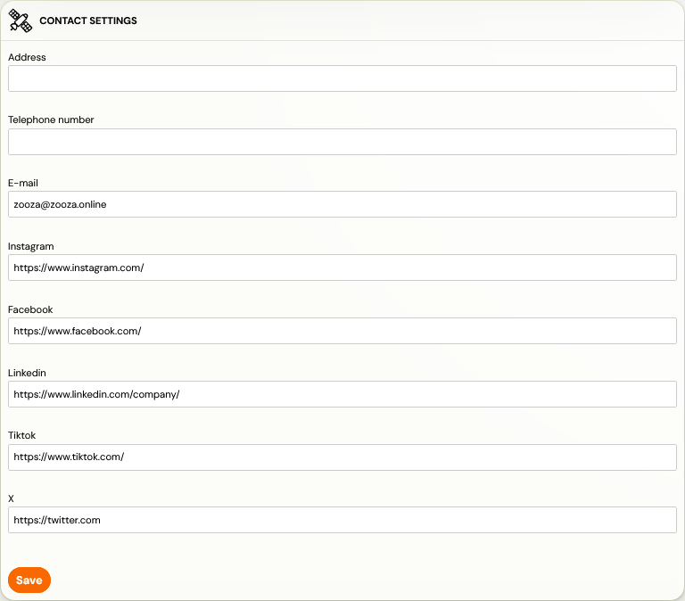

# Zooza Sites

If you don’t have your own website and would like to make it as easy as possible to implement your programmes that you manage in Zooza, we offer you Zooza Sites service, i.e. your own website under our roof.

## What Zooza sites offers

In addition to having all the settings for either the programmes or the site in one place, you also have access to other features of the site like:

1. 4 templates with predefined page structure, each template has multiple color schemes
2. Your own domain – mycompany.com, or on zooza.site domain – mycompany.zooza.site
3. Several language modifications of the page

For more information about Zooza Sites click on this link: [https://www.zooza.online/sites/.](https://www.zooza.online/sites/.)

## Benefits

1. All the basic tools are ready and integrated into your website. You don’t have to worry about uploading scripts for booking forms or client profiles.
2. Simple and consistent page layout – custom header/footer that is available on all pages equally.
3. Every change is automatically applied to the page, you don’t have to worry about technical details.
4. Possibility to create your own photo gallery.
5. You don’t need an admin to create and update Zooza Sites, you can set everything up yourself.
6. There are 4 price packages to choose from, which are later added to your Zooza invoice.

## Creating Zooza sites

1. Setting up your own page is available in the general settings under* Web page.*
 
2. You will be taken to the overview where you have the option to edit the page settings:
3. General settings
4. Domain
5. Templates
6. Contact settings
7. Languages

Consent and agreements
Pages
Possibility to edit individual subpages in all languages

## General settings

### Domain

The page will be generated automatically on our Zooza domain. If you are interested in your own domain, you can buy it for a regular fee.

### Templates

The template you choose for your page has a predefined Zooza colour palette. However, you can change this palette by changing 3 custom colors. Another change you can make is to change the font according to the available menu.

You can customize templates and color themes in the general settings.

### Contact

Zooza will make it easy for you to know how and where your clients can reach you with a contact form that you don’t need to insert anywhere extra, just fill it in and once saved it will show up on your new page.

## Consents and agreements

The management of individual consents is done in *Settings – General settings – Consents. *These are then displayed in the Zooza Sites *Consents and Agreements* settings as a list from which you can select which one you want to publish. These will then also be displayed on the page in the footer of the page.

## Languages

For all pages, you have a choice of several languages from which you can choose which you want to allow on your page and which you don’t.

## Pages

You manage all the pages you create in Zooza. Whether you want to set what logo you want in the header, what you want the homepage to look like, or what text you want for each subpage. In the Zooza Sites settings, under *Pages *, you set:

1. Homepage
2. About us
3. Gallery
4. Programmes – contains only basic information regarding the page name or a short description. You can make other settings about individual programmes in the programme details, in the *Programme Settings* tile.
