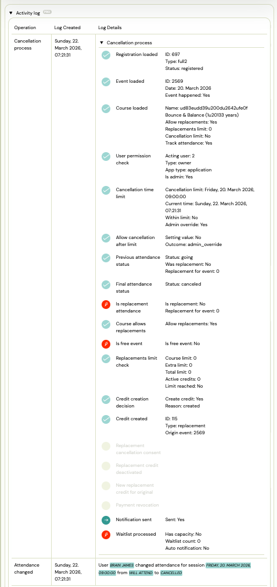

# Understanding the Cancellation Log

When a client or admin cancels attendance on a session, Zooza records every decision made during the process — whether the deadline was enforced, whether a replacement credit was issued, and why. This log is visible in the session audit trail.

Use it to answer common questions like:
- *"Why was this client able to cancel after the deadline?"*
- *"Why didn't they get a replacement credit?"*
- *"Why was the credit limit not applied?"*

---

## Where to find the cancellation log

1. Open the booking detail.
2. Go to the **Attendance** section.
3. Find the cancelled session and click on the audit entry or expand the cancellation record.

The log shows each decision point with its result (passed / skipped / blocked) and the values used at the time of cancellation.

---

## What the log records

### Cancellation deadline check
Whether the cancellation happened within the allowed window. The log captures:
- The configured deadline (e.g., 24 hours before the session)
- The actual time of cancellation relative to the session
- Whether the deadline was enforced or bypassed (e.g., admin override)

### Replacement credit decision
Whether a replacement session credit was issued. The log captures:
- Whether the programme has replacements enabled
- Whether the client had already reached the replacement limit
- Whether the cancelled session was itself a replacement (replacements of replacements are not credited)
- The final decision: credit issued or not

### Admin override
If an admin cancelled on behalf of a client outside the normal deadline window, this is recorded as an override. The log shows who performed the action.

---

## Common scenarios explained

| Situation | What the log will show |
|---|---|
| Client cancelled before deadline, got credit | Deadline check: passed. Credit: issued. |
| Client cancelled after deadline, no credit | Deadline check: failed. Credit: not issued (deadline not met). |
| Admin cancelled after deadline | Deadline check: bypassed (admin action). Credit: depends on programme settings. |
| Client reached replacement limit | Deadline check: passed. Credit: not issued (replacement limit reached). |
| Cancellation of a replacement session | Credit: not issued (replacements of replacements not allowed). |

---

## Frequently asked questions

### Can I change the outcome of a past cancellation?

No. The log is read-only. If you need to manually issue a replacement credit or reverse a cancellation, use the booking's **Attendance** actions to add a session or adjust the status directly.

### Who can see the cancellation log?

Any admin with access to the booking can view the log.

### Does the log appear for group cancellations?

Yes. When a session is cancelled for an entire class, each individual booking generates its own cancellation log entry.
