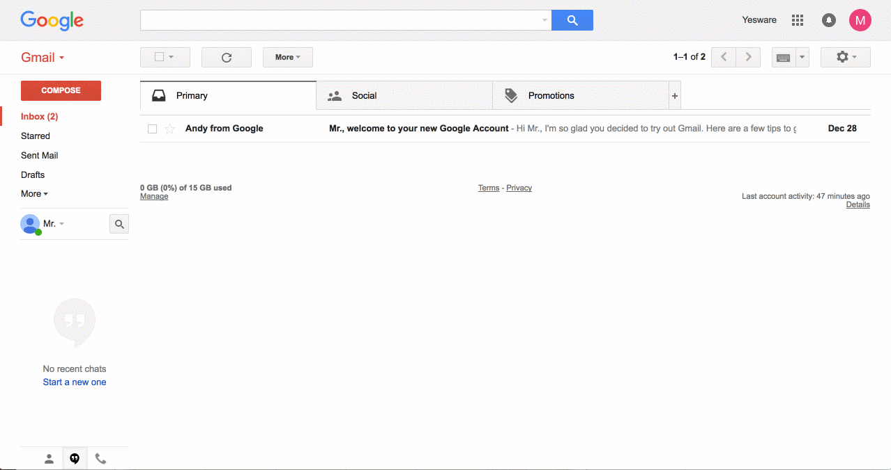

# Receiving e-mails from Zooza in Primary Inbox

Many times clients complain that they do not receive notification emails from the system. These emails can end up in spam or advertising.
But this dropping of emails into the junk folder is affected by Gmail's functionality, not by us. Because based on our findings, no emails end up in the junk mail.
The more people use a particular email, the more often it will move into primary communication. Clients can also forward such emails themselves as follows:

