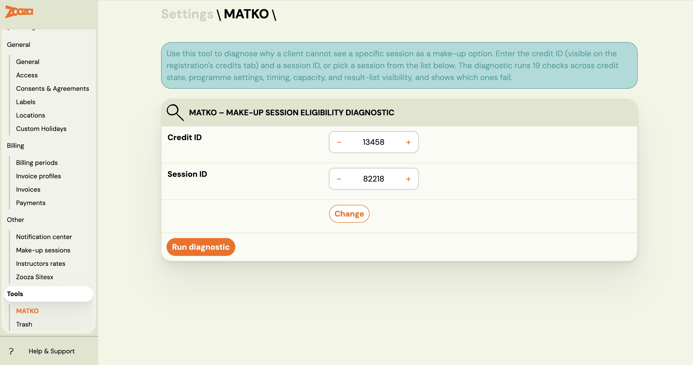
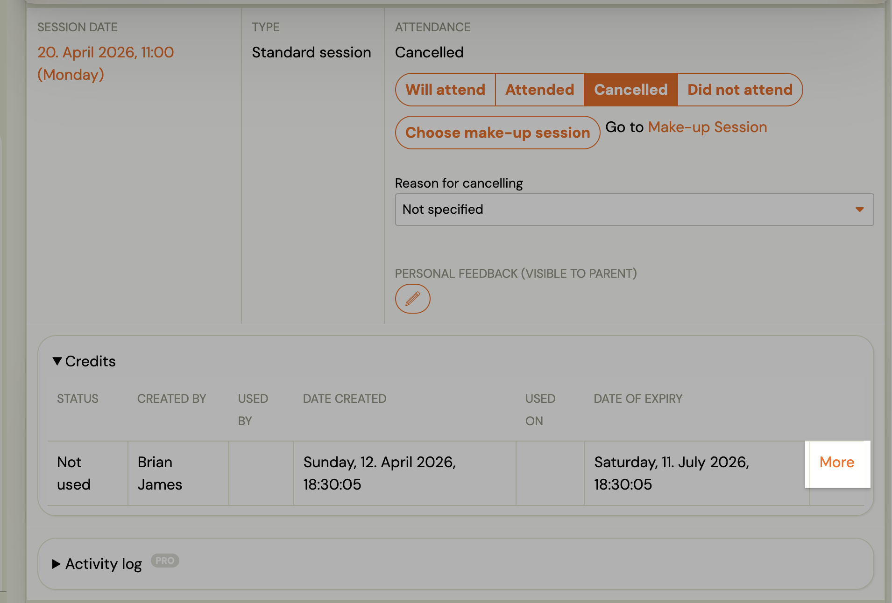
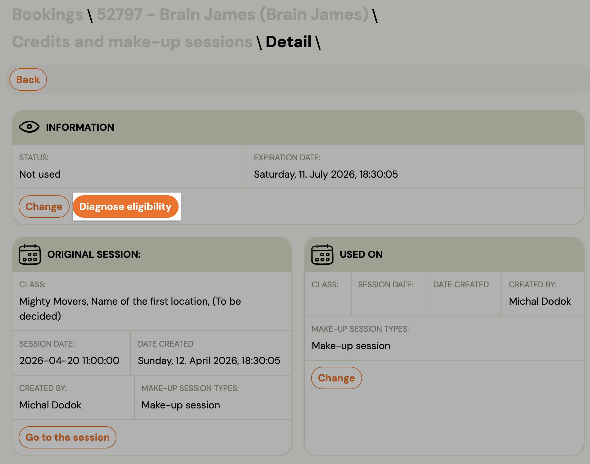
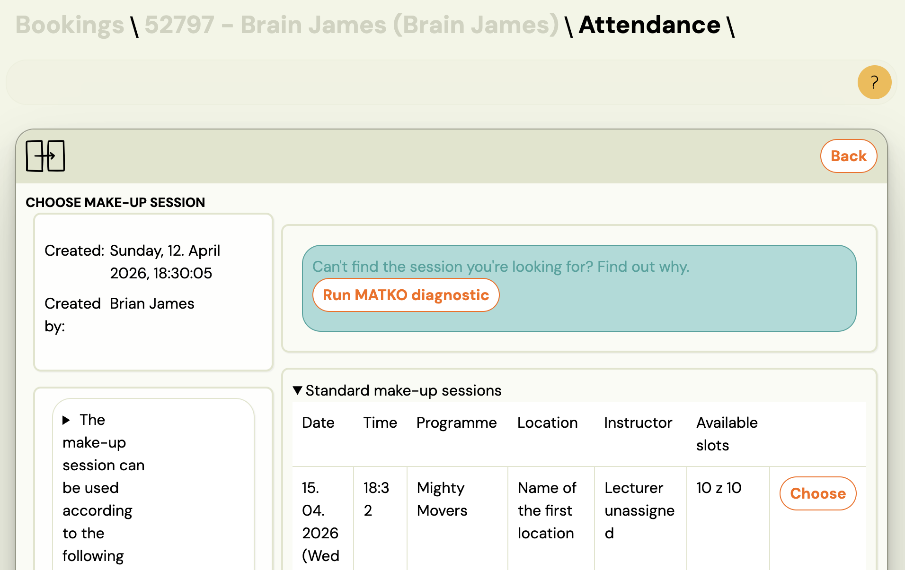
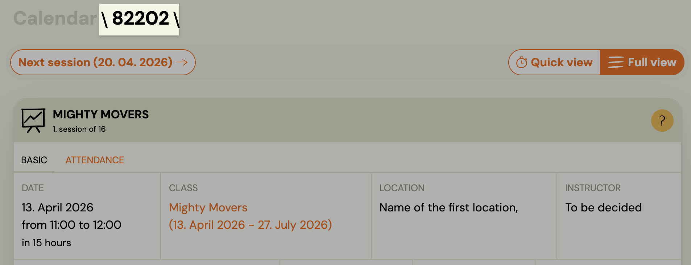
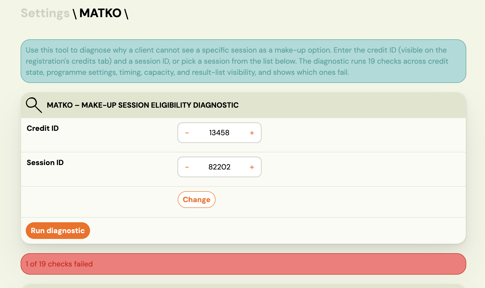
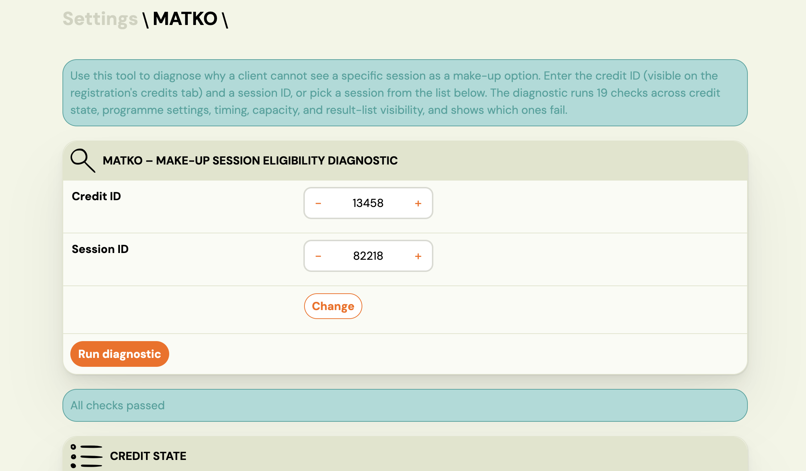
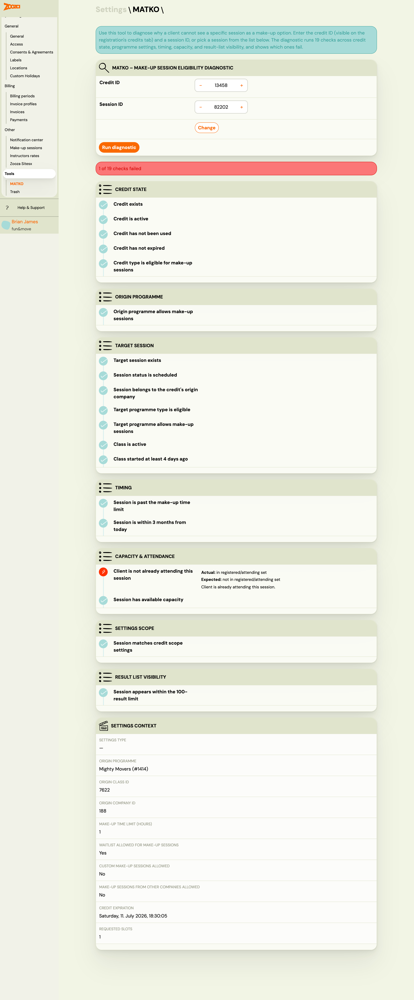

# MATKO — Diagnose why a make-up session is not showing

MATKO (Make-up Attendance Testing & Knowledge Oracle) is a diagnostic tool for admins and support staff. It answers the question *"why can't this client see session X as a make-up option?"* in seconds, without guesswork or developer escalation.

You give it a credit ID and a session ID. It runs 19 eligibility checks across 7 tiers and shows you exactly which ones pass, which fail, and what to fix.

> **Access:** Settings → Tools → MATKO. Requires owner or assistant role with `get_registrations` permission.

---

## How to open MATKO

There are three ways to reach the tool — each pre-fills as much context as possible.

### From Settings → Tools

Go to **Settings → Tools → MATKO**. Both fields start empty. Enter the Credit ID and Session ID manually and click **Run diagnostic**.

### From a client's credits list

Open the client's registration → **Credits** tab. Every replacement credit, replacement transfer, or free-event credit in the list has a **Diagnose replacements** link. Click it to open MATKO with the Credit ID pre-filled.

### From the replacement finder (empty results)

When a client's replacement finder returns no results, an info notice appears at the bottom: *"Didn't find the session you were looking for? Find out why →"*. The link opens MATKO with the Credit ID pre-filled. You still need to enter the Session ID.

---

## Finding the Credit ID and Session ID

**Credit ID** — Go to the client's registration → **Credits** tab. The ID is shown in each credit row, or visible in the URL when you open a credit detail (`?credit_id=…`).

**Session ID** — Use the session picker built into the MATKO page. It lets you filter by date, programme, and instructor. Click a row to pre-fill the Session ID automatically. You can also find the ID in the session URL (`#sessions/…/{id}`).

---

## Running a diagnostic

1. Enter the Credit ID.
2. Select or enter the Session ID.
3. Click **Run diagnostic**.

If you arrived via a deep link with both IDs in the URL, the diagnostic runs automatically on page load.

---

## Reading the results

### Overall result

The banner at the top tells you the outcome:

| Banner colour | Meaning |
|---|---|
| Green | All 19 checks passed. The session should appear in the client's list. |
| Red | One or more checks failed. The session is not eligible. |
| Orange / info | The session is eligible, but it is cut off by the 100-result display limit. |

### The 100-result cutoff warning

If the only failing check is `within_result_limit`, the banner shows an orange warning instead of a red error: *"The session is eligible but is cut off by the 100-result limit."*

This is a fundamentally different situation from "not eligible". The fix is to reduce the pool of available make-up sessions so fewer options compete for those 100 slots — for example, by narrowing the programme scope or removing extra capacity from less-relevant classes.

### The 7 tiers and 19 checks

Checks are grouped into 7 tiers. Each tier is displayed as a collapsible section. A failing check in any tier (except Tier 7) means the session is ineligible.

| Tier | Name | What it checks |
|---|---|---|
| 1 | **Credit scan** | Credit exists, is active, has not expired, and is of an eligible type (replacement, replacement transfer, or free event) |
| 2 | **Origin programme** | The programme this credit came from has make-up sessions enabled |
| 3 | **Target session** | The target session exists, belongs to a class, the target programme type is eligible, and the class started at least 4 days ago |
| 4 | **Timing** | The session has not already started and is within the configured transfer time limit |
| 5 | **Capacity & attendance** | The client is not already attending this session, and the session has available capacity (including extra make-up slots) |
| 6 | **Settings scope** | The session passes the programme-level scope restrictions (programme match, time restriction, cancellation window) |
| 7 | **Result visibility** | The session appears within the top 100 results returned to the client |

Each failing check shows three things:
- **Actual** — the value the system found
- **Expected** — what would be needed to pass
- **Hint** — a plain-language explanation of what to fix

### Settings context panel

Below the checklist, a panel shows the current programme and system settings that influenced the checks — for example, the time restriction in hours, the credit expiry date, and the capacity settings. This tells you the exact values the system used, so you can compare them against what you have configured.

---

## Common failure patterns and fixes

| Failing check | What it means | Fix |
|---|---|---|
| `credit_expired` | The make-up credit's expiry date has passed | Extend the expiry date on the credit, or adjust the global expiration setting |
| `schedule_scope_match` | The session belongs to a programme or class not in scope for this credit | Check make-up session scope settings on the programme |
| `capacity_available` | No free spots (including extra make-up capacity) | Increase extra capacity on the class, or wait for a cancellation |
| `time_restriction` | The session starts too soon (within the configured hours limit) | Wait, or lower the time restriction in **Settings → General** |
| `four_day_rule` | The class has not yet started (starts more than 4 days from now) | Normal behaviour for new classes — no action needed |
| `within_result_limit` | Session is eligible but beyond position 100 | Narrow the make-up offer in programme settings to reduce competition |

---

## Limitations

- **Admin and support only.** MATKO is not visible to clients.
- **Read-only.** The tool diagnoses but does not fix anything. Navigate to the relevant settings screen to make changes.
- **Single credit + session at a time.** Bulk diagnostics are not supported.
- **Cross-company credits.** MATKO cannot diagnose credits owned by another company in a franchise network. It returns a "credit not found" error in that case — this is by design to prevent cross-tenant data exposure.

---

## Related

- [Make-up sessions FAQ](../faq/make-up-sessions-faq.md) — common questions about make-up session availability
- [Make-up sessions complete guide](../guides/replacement-hours-complete.md) — full setup and configuration
- [Cancellation log](../troubleshooting/cancellation-log.md) — audit trail for session cancellations
