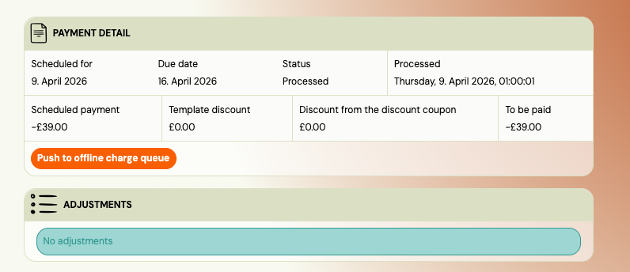

# Manually push a scheduled payment to offline charge

When a payment plan uses offline charging (Stripe card or GoCardless Direct Debit), Zooza normally sends each scheduled payment to the charge queue automatically when it is processed. Occasionally, a payment can end up in **processed** status without being enqueued — for example, if offline charging was temporarily disabled at the moment of processing. In that case, the payment never gets charged and no error is surfaced to the client.

This page explains how to detect this situation and push the payment manually.

---

## Symptoms

- A scheduled payment shows status **Processed** on the payment plan.
- The expected charge has not appeared on the client's card or bank account.
- No error was shown when the payment was processed.

---

## Check the payment detail

1. Open the client's booking.
2. Go to **Payments → Payment plan**.
3. Find the payment with **Processed** status and click **More** to open the detail page.
4. In the **Payment Info** card, look for one of two indicators:
   - **"Push to offline charge queue"** button — the payment was never queued; you can push it now.
   - **"This payment is in the offline charge queue."** notice — the payment is already queued; wait for the charge to process.

If neither indicator appears, offline charging may not be enabled on this payment plan. Check the parent payment plan settings.

---

## Push the payment manually

1. On the scheduled payment detail page, click **Push to offline charge queue**.
2. Zooza verifies that the client still has a valid card or direct debit mandate on file.
3. If verification passes, the payment is added to the offline charge queue. The button disappears and the "in queue" notice appears.
4. The existing offline charging process picks up the payment and attempts the charge. You can monitor the result in the charge log.

---

## Error messages

| Error | Meaning | Action |
|---|---|---|
| **Offline charging is no longer enabled on this payment plan** | The payment plan's offline charge setting was turned off. | Re-enable offline charging on the payment plan, then try again. |
| **This payment is already in the offline charge queue** | Another push already enqueued it. | Wait for the charge to complete. Refresh the page. |
| **Only processed payments can be pushed** | The payment is in a different status (scheduled, cancelled, etc.). | No action needed — only processed payments can be pushed. |
| **No offline charge provider on file** | The client's card or mandate is missing. | Ask the client to update their payment method via their profile. |
| **Card or mandate is no longer available** | The card expired or the mandate was cancelled since processing. | Ask the client to update their payment method, then try again. |

---

## Related

- [GoCardless Direct Debit](../setup/gocardless-direct-debit-mandates.md)
- [Payment schedules](../guides/ad-hoc-scheduled-payment.md)
